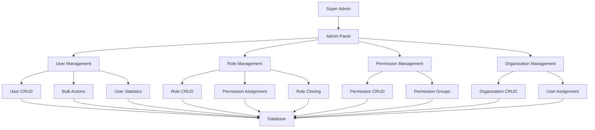

# 🏛️ Admin Management System

## 📋 Overview

Sistem manajemen admin yang lengkap untuk superadmin dengan fitur manajemen users, roles, permissions, dan organizations. Sistem ini menggunakan database yang sudah ada dan mengikuti best practices untuk keamanan dan skalabilitas.

## 🎯 Features

### ✅ **User Management**
- ✅ CRUD operations untuk users
- ✅ Bulk actions (activate, deactivate, delete, restore)
- ✅ User statistics dan analytics
- ✅ Export data (CSV, JSON)
- ✅ Session management
- ✅ Role assignment
- ✅ Security features (2FA, password policies)

### ✅ **Role Management**
- ✅ CRUD operations untuk roles
- ✅ Permission assignment/removal
- ✅ Role hierarchy dan inheritance
- ✅ Role cloning
- ✅ Role statistics
- ✅ Scope-based roles (global, organization, department, team, personal)

### ✅ **Permission Management**
- ✅ CRUD operations untuk permissions
- ✅ Resource-based permissions
- ✅ Action-based permissions
- ✅ Permission groups
- ✅ Permission inheritance
- ✅ Granular access control

### ✅ **Organization Management**
- ✅ CRUD operations untuk organizations
- ✅ User assignment ke organizations
- ✅ Organization statistics
- ✅ Multi-tenant support

### ✅ **Security Features**
- ✅ Role-based access control (RBAC)
- ✅ Permission-based authorization
- ✅ Audit logging
- ✅ Session management
- ✅ Rate limiting
- ✅ Input validation

## 🏗️ Architecture



## 📁 File Structure

```
app/
├── Http/
│   ├── Controllers/
│   │   └── Api/
│   │       └── Admin/
│   │           ├── UserManagementController.php      # 🆕 User management
│   │           ├── RoleManagementController.php      # 🆕 Role management
│   │           ├── PermissionManagementController.php # 🆕 Permission management
│   │           └── OrganizationManagementController.php # 🆕 Organization management
│   ├── Requests/
│   │   └── Admin/
│   │       ├── CreateUserRequest.php                 # 🆕 User validation
│   │       ├── UpdateUserRequest.php                 # 🆕 User validation
│   │       ├── BulkActionRequest.php                 # 🆕 Bulk action validation
│   │       ├── CreateRoleRequest.php                 # 🆕 Role validation
│   │       └── UpdateRoleRequest.php                 # 🆕 Role validation
│   └── Resources/
│       └── Admin/
│           ├── UserResource.php                      # 🆕 User response format
│           ├── UserCollection.php                    # 🆕 User list response
│           ├── RoleResource.php                      # 🆕 Role response format
│           └── RoleCollection.php                    # 🆕 Role list response
├── Services/
│   └── Admin/
│       ├── UserManagementService.php                 # 🆕 User business logic
│       ├── RoleManagementService.php                 # 🆕 Role business logic
│       ├── PermissionManagementService.php           # 🆕 Permission business logic
│       └── OrganizationManagementService.php         # 🆕 Organization business logic
└── Models/
    ├── User.php                                      # ✅ Enhanced user model
    ├── Role.php                                       # ✅ Role model
    ├── Permission.php                                 # ✅ Permission model
    ├── UserRole.php                                   # ✅ User-role relationship
    ├── RolePermission.php                             # ✅ Role-permission relationship
    └── Organization.php                               # ✅ Organization model

routes/
└── admin.php                                         # 🆕 Admin routes

database/migrations/
├── roles_table.php                                   # ✅ Role structure
├── permissions_table.php                             # ✅ Permission structure
├── role_permissions_table.php                        # ✅ Role-permission pivot
├── user_roles_table.php                              # ✅ User-role pivot
└── permission_groups_table.php                       # ✅ Permission groups
```

## 🔧 Database Schema

### **Users Table** (Enhanced)
```sql
CREATE TABLE users (
    id UUID PRIMARY KEY,
    organization_id UUID REFERENCES organizations(id),
    email VARCHAR(255) UNIQUE NOT NULL,
    username VARCHAR(100) UNIQUE NOT NULL,
    password_hash VARCHAR(255) NOT NULL,
    full_name VARCHAR(255) NOT NULL,
    first_name VARCHAR(100),
    last_name VARCHAR(100),
    phone VARCHAR(20),
    avatar_url VARCHAR(500),
    role ENUM('super_admin', 'org_admin', 'agent', 'customer', 'viewer', 'moderator', 'developer'),
    
    -- Authentication & Security
    is_email_verified BOOLEAN DEFAULT FALSE,
    is_phone_verified BOOLEAN DEFAULT FALSE,
    two_factor_enabled BOOLEAN DEFAULT FALSE,
    two_factor_secret VARCHAR(255),
    backup_codes JSON,
    last_login_at TIMESTAMP,
    last_login_ip INET,
    login_count INTEGER DEFAULT 0,
    failed_login_attempts INTEGER DEFAULT 0,
    locked_until TIMESTAMP,
    password_changed_at TIMESTAMP DEFAULT NOW(),
    
    -- Session Management
    active_sessions JSON DEFAULT '[]',
    max_concurrent_sessions INTEGER DEFAULT 3,
    
    -- UI/UX Preferences
    ui_preferences JSON DEFAULT '{}',
    dashboard_config JSON DEFAULT '{}',
    notification_preferences JSON DEFAULT '{}',
    
    -- Profile & Activity
    bio TEXT,
    location VARCHAR(255),
    department VARCHAR(100),
    job_title VARCHAR(100),
    skills JSON,
    languages JSON DEFAULT '["id"]',
    
    -- API Access
    api_access_enabled BOOLEAN DEFAULT FALSE,
    api_rate_limit INTEGER DEFAULT 100,
    
    -- System fields
    permissions JSON DEFAULT '{}',
    status ENUM('active', 'inactive', 'suspended', 'deleted', 'pending', 'draft') DEFAULT 'active',
    created_at TIMESTAMP DEFAULT NOW(),
    updated_at TIMESTAMP DEFAULT NOW(),
    deleted_at TIMESTAMP
);
```

### **Roles Table**
```sql
CREATE TABLE roles (
    id UUID PRIMARY KEY,
    organization_id UUID REFERENCES organizations(id),
    
    -- Role Identity
    name VARCHAR(100) NOT NULL,
    code VARCHAR(50) UNIQUE NOT NULL,
    display_name VARCHAR(255),
    description TEXT,
    
    -- Role Configuration
    scope ENUM('global', 'organization', 'department', 'team', 'personal') DEFAULT 'organization',
    level INTEGER DEFAULT 1,
    is_system_role BOOLEAN DEFAULT FALSE,
    is_default BOOLEAN DEFAULT FALSE,
    
    -- Inheritance
    parent_role_id UUID REFERENCES roles(id),
    inherits_permissions BOOLEAN DEFAULT TRUE,
    
    -- Access Control
    max_users INTEGER,
    current_users INTEGER DEFAULT 0,
    
    -- UI/UX
    color VARCHAR(7) DEFAULT '#6B7280',
    icon VARCHAR(50),
    badge_text VARCHAR(20),
    
    -- System fields
    metadata JSON DEFAULT '{}',
    status ENUM('active', 'inactive', 'suspended', 'deleted', 'pending', 'draft', 'published', 'archived') DEFAULT 'active',
    created_at TIMESTAMP DEFAULT NOW(),
    updated_at TIMESTAMP DEFAULT NOW(),
    
    UNIQUE(organization_id, code)
);
```

### **Permissions Table**
```sql
CREATE TABLE permissions (
    id UUID PRIMARY KEY,
    organization_id UUID REFERENCES organizations(id),
    
    -- Permission Identity
    name VARCHAR(100) NOT NULL,
    code VARCHAR(100) UNIQUE NOT NULL,
    display_name VARCHAR(255),
    description TEXT,
    
    -- Permission Details
    resource ENUM('users', 'agents', 'customers', 'chat_sessions', 'messages', 'knowledge_articles', 'knowledge_categories', 'bot_personalities', 'channel_configs', 'ai_models', 'workflows', 'analytics', 'billing', 'subscriptions', 'api_keys', 'webhooks', 'system_logs', 'organizations', 'roles', 'permissions'),
    action ENUM('create', 'read', 'update', 'delete', 'execute', 'approve', 'publish', 'export', 'import', 'manage', 'view_all', 'view_own', 'edit_all', 'edit_own'),
    scope ENUM('global', 'organization', 'department', 'team', 'personal') DEFAULT 'organization',
    
    -- Conditions & Constraints
    conditions JSON DEFAULT '{}',
    constraints JSON DEFAULT '{}',
    
    -- Grouping
    category VARCHAR(100),
    group_name VARCHAR(100),
    
    -- System fields
    is_system_permission BOOLEAN DEFAULT FALSE,
    is_dangerous BOOLEAN DEFAULT FALSE,
    requires_approval BOOLEAN DEFAULT FALSE,
    
    -- UI/UX
    sort_order INTEGER DEFAULT 0,
    is_visible BOOLEAN DEFAULT TRUE,
    
    -- System fields
    metadata JSON DEFAULT '{}',
    status ENUM('active', 'inactive', 'suspended', 'deleted', 'pending', 'draft', 'published', 'archived') DEFAULT 'active',
    created_at TIMESTAMP DEFAULT NOW(),
    updated_at TIMESTAMP DEFAULT NOW(),
    
    UNIQUE(organization_id, code),
    UNIQUE(resource, action, scope, organization_id)
);
```

## 🚀 API Endpoints

### **User Management**
```bash
# List users with filters
GET /api/admin/users?search=john&status=active&role=agent&page=1&per_page=15

# Get user statistics
GET /api/admin/users/statistics

# Export users
GET /api/admin/users/export?format=csv&status=active

# Bulk actions
POST /api/admin/users/bulk-action
{
    "action": "activate",
    "user_ids": ["uuid1", "uuid2", "uuid3"]
}

# Individual user operations
GET /api/admin/users/{userId}
POST /api/admin/users
PUT /api/admin/users/{userId}
DELETE /api/admin/users/{userId}
POST /api/admin/users/{userId}/restore
DELETE /api/admin/users/{userId}/force
```

### **Role Management**
```bash
# List roles with filters
GET /api/admin/roles?search=admin&scope=organization&is_system_role=false

# Get role statistics
GET /api/admin/roles/statistics

# Clone role
POST /api/admin/roles/{roleId}/clone
{
    "name": "New Role Name",
    "code": "new_role_code",
    "display_name": "New Role Display Name",
    "description": "New role description"
}

# Individual role operations
GET /api/admin/roles/{roleId}
POST /api/admin/roles
PUT /api/admin/roles/{roleId}
DELETE /api/admin/roles/{roleId}

# Permission management
POST /api/admin/roles/{roleId}/permissions
{
    "permissions": ["permission1", "permission2", "permission3"]
}

DELETE /api/admin/roles/{roleId}/permissions
{
    "permissions": ["permission1", "permission2"]
}
```

### **Permission Management**
```bash
# List permissions with filters
GET /api/admin/permissions?resource=users&action=read&scope=organization

# Get permission statistics
GET /api/admin/permissions/statistics

# Individual permission operations
GET /api/admin/permissions/{permissionId}
POST /api/admin/permissions
PUT /api/admin/permissions/{permissionId}
DELETE /api/admin/permissions/{permissionId}
```

### **Organization Management**
```bash
# List organizations with filters
GET /api/admin/organizations?search=company&status=active

# Get organization statistics
GET /api/admin/organizations/statistics

# Individual organization operations
GET /api/admin/organizations/{organizationId}
POST /api/admin/organizations
PUT /api/admin/organizations/{organizationId}
DELETE /api/admin/organizations/{organizationId}

# Organization users management
GET /api/admin/organizations/{organizationId}/users
POST /api/admin/organizations/{organizationId}/users
DELETE /api/admin/organizations/{organizationId}/users/{userId}
```

### **System Dashboard**
```bash
# System overview
GET /api/admin/dashboard/overview

# System logs
GET /api/admin/dashboard/logs?level=error&organization_id=uuid&page=1
```

## 🔒 Security & Permissions

### **Permission System**
```php
// Check if user has permission
if (auth()->user()->hasPermission('users.create')) {
    // User can create users
}

// Check if user has role
if (auth()->user()->hasRole('super_admin')) {
    // User is super admin
}

// Check if user has any of the roles
if (auth()->user()->hasAnyRole(['admin', 'moderator'])) {
    // User has admin or moderator role
}

// Check if user has all roles
if (auth()->user()->hasAllRoles(['admin', 'moderator'])) {
    // User has both admin and moderator roles
}
```

### **Middleware Protection**
```php
// Route protection with permissions
Route::middleware(['unified.auth', 'can:manage-users'])->group(function () {
    Route::get('/users', [UserController::class, 'index'])->middleware(['can:users.read']);
    Route::post('/users', [UserController::class, 'store'])->middleware(['can:users.create']);
    Route::put('/users/{id}', [UserController::class, 'update'])->middleware(['can:users.update']);
    Route::delete('/users/{id}', [UserController::class, 'destroy'])->middleware(['can:users.delete']);
});
```

### **Default Permissions**
```php
// System permissions that are created by default
$defaultPermissions = [
    // User Management
    ['users.create', 'Create users'],
    ['users.read', 'View users'],
    ['users.update', 'Update users'],
    ['users.delete', 'Delete users'],
    ['users.restore', 'Restore deleted users'],
    ['users.force_delete', 'Permanently delete users'],
    ['users.bulk_action', 'Perform bulk actions on users'],
    ['users.export', 'Export user data'],
    
    // Role Management
    ['roles.create', 'Create roles'],
    ['roles.read', 'View roles'],
    ['roles.update', 'Update roles'],
    ['roles.delete', 'Delete roles'],
    ['roles.assign_permissions', 'Assign permissions to roles'],
    ['roles.remove_permissions', 'Remove permissions from roles'],
    
    // Permission Management
    ['permissions.create', 'Create permissions'],
    ['permissions.read', 'View permissions'],
    ['permissions.update', 'Update permissions'],
    ['permissions.delete', 'Delete permissions'],
    
    // Organization Management
    ['organizations.create', 'Create organizations'],
    ['organizations.read', 'View organizations'],
    ['organizations.update', 'Update organizations'],
    ['organizations.delete', 'Delete organizations'],
    ['organizations.add_user', 'Add users to organizations'],
    ['organizations.remove_user', 'Remove users from organizations'],
    
    // System Access
    ['access-admin-panel', 'Access admin panel'],
    ['access-admin-dashboard', 'Access admin dashboard'],
    ['view-system-logs', 'View system logs'],
];
```

## 📊 Usage Examples

### **Creating a User with Roles**
```php
// Create user with roles
$userData = [
    'email' => 'john.doe@example.com',
    'username' => 'johndoe',
    'password' => 'SecurePassword123!',
    'full_name' => 'John Doe',
    'role' => 'agent',
    'organization_id' => 'org-uuid',
    'roles' => ['role-uuid-1', 'role-uuid-2'],
    'send_welcome_email' => true
];

$user = $userManagementService->createUser($userData, auth()->user());
```

### **Assigning Permissions to Role**
```php
// Assign permissions to role
$permissionIds = [
    'permission-uuid-1',
    'permission-uuid-2',
    'permission-uuid-3'
];

$role = $roleManagementService->assignPermissionsToRole($roleId, $permissionIds, auth()->user());
```

### **Bulk User Actions**
```php
// Bulk activate users
$result = $userManagementService->performBulkAction('activate', $userIds, auth()->user());

// Result format
[
    'action' => 'activate',
    'total_count' => 10,
    'success_count' => 8,
    'failed_count' => 2,
    'errors' => [
        'Error processing user uuid1: User not found',
        'Error processing user uuid2: Cannot activate suspended user'
    ]
]
```

## 🎨 Frontend Integration

### **React Components Example**
```jsx
// User Management Component
import React, { useState, useEffect } from 'react';
import { useAuth } from '../contexts/AuthContext';

const UserManagement = () => {
  const [users, setUsers] = useState([]);
  const [loading, setLoading] = useState(false);
  const { authService } = useAuth();

  const fetchUsers = async () => {
    try {
      setLoading(true);
      const response = await authService.getApi().get('/admin/users');
      setUsers(response.data.data);
    } catch (error) {
      console.error('Failed to fetch users:', error);
    } finally {
      setLoading(false);
    }
  };

  const createUser = async (userData) => {
    try {
      const response = await authService.getApi().post('/admin/users', userData);
      fetchUsers(); // Refresh list
      return response.data;
    } catch (error) {
      console.error('Failed to create user:', error);
      throw error;
    }
  };

  const bulkAction = async (action, userIds) => {
    try {
      const response = await authService.getApi().post('/admin/users/bulk-action', {
        action,
        user_ids: userIds
      });
      fetchUsers(); // Refresh list
      return response.data;
    } catch (error) {
      console.error('Failed to perform bulk action:', error);
      throw error;
    }
  };

  useEffect(() => {
    fetchUsers();
  }, []);

  return (
    <div>
      <h1>User Management</h1>
      {loading ? (
        <div>Loading users...</div>
      ) : (
        <div>
          {users.map(user => (
            <div key={user.id}>
              <h3>{user.full_name}</h3>
              <p>Email: {user.email}</p>
              <p>Role: {user.role}</p>
              <p>Status: {user.status}</p>
            </div>
          ))}
        </div>
      )}
    </div>
  );
};

export default UserManagement;
```

## 🧪 Testing

### **Unit Tests**
```php
// UserManagementServiceTest.php
class UserManagementServiceTest extends TestCase
{
    public function test_can_create_user_with_roles()
    {
        $admin = User::factory()->create(['role' => 'super_admin']);
        $userData = [
            'email' => 'test@example.com',
            'username' => 'testuser',
            'password' => 'Password123!',
            'full_name' => 'Test User',
            'role' => 'agent',
            'organization_id' => Organization::factory()->create()->id,
            'roles' => [Role::factory()->create()->id]
        ];

        $user = app(UserManagementService::class)->createUser($userData, $admin);

        $this->assertInstanceOf(User::class, $user);
        $this->assertEquals('test@example.com', $user->email);
        $this->assertCount(1, $user->roles);
    }

    public function test_cannot_delete_super_admin()
    {
        $admin = User::factory()->create(['role' => 'super_admin']);
        $superAdmin = User::factory()->create(['role' => 'super_admin']);

        $this->expectException(\Exception::class);
        $this->expectExceptionMessage('Cannot delete super admin user');

        app(UserManagementService::class)->deleteUser($superAdmin->id, $admin);
    }
}
```

### **Feature Tests**
```php
// AdminUserManagementTest.php
class AdminUserManagementTest extends TestCase
{
    public function test_super_admin_can_view_users()
    {
        $admin = User::factory()->create(['role' => 'super_admin']);
        $user = User::factory()->create();

        $response = $this->actingAs($admin)
            ->getJson('/api/admin/users');

        $response->assertStatus(200)
            ->assertJsonStructure([
                'success',
                'data' => [
                    'data' => [
                        '*' => ['id', 'email', 'full_name', 'role', 'status']
                    ],
                    'pagination'
                ]
            ]);
    }

    public function test_non_admin_cannot_access_user_management()
    {
        $user = User::factory()->create(['role' => 'customer']);

        $response = $this->actingAs($user)
            ->getJson('/api/admin/users');

        $response->assertStatus(403);
    }
}
```

## 🚀 Deployment

### **Environment Setup**
```bash
# Set admin-specific environment variables
ADMIN_PANEL_ENABLED=true
ADMIN_DEFAULT_PERMISSIONS=true
ADMIN_AUDIT_LOGGING=true
ADMIN_RATE_LIMITING=true

# Database migrations
php artisan migrate

# Seed default permissions and roles
php artisan db:seed --class=AdminPermissionsSeeder
php artisan db:seed --class=AdminRolesSeeder

# Create super admin user
php artisan admin:create-super-admin
```

### **Production Checklist**
- [ ] Set secure admin credentials
- [ ] Configure audit logging
- [ ] Set up monitoring and alerts
- [ ] Test all admin functions
- [ ] Configure backup for admin data
- [ ] Set up rate limiting
- [ ] Test permission system
- [ ] Verify role inheritance
- [ ] Test bulk operations
- [ ] Configure email notifications

## 📈 Monitoring & Analytics

### **Admin Dashboard Metrics**
```php
// Key metrics for admin dashboard
$metrics = [
    'total_users' => User::count(),
    'active_users' => User::where('status', 'active')->count(),
    'new_users_this_month' => User::where('created_at', '>=', now()->startOfMonth())->count(),
    'users_with_2fa' => User::where('two_factor_enabled', true)->count(),
    'total_roles' => Role::count(),
    'total_permissions' => Permission::count(),
    'active_sessions' => UserSession::where('is_active', true)->count(),
    'system_health' => [
        'database' => $this->checkDatabaseHealth(),
        'cache' => $this->checkCacheHealth(),
        'queue' => $this->checkQueueHealth(),
    ]
];
```

### **Audit Logging**
```php
// Log admin actions
Log::channel('admin')->info('User created by admin', [
    'admin_id' => auth()->id(),
    'admin_email' => auth()->user()->email,
    'target_user_id' => $user->id,
    'target_user_email' => $user->email,
    'action' => 'user.created',
    'ip_address' => request()->ip(),
    'user_agent' => request()->userAgent(),
    'timestamp' => now()->toISOString(),
]);
```

## 🔧 Troubleshooting

### **Common Issues**

1. **Permission Denied Errors**
   ```bash
   # Check user permissions
   php artisan tinker
   >>> $user = User::find('user-uuid');
   >>> $user->permissions;
   >>> $user->roles;
   ```

2. **Role Assignment Issues**
   ```bash
   # Check role assignments
   php artisan tinker
   >>> $role = Role::find('role-uuid');
   >>> $role->users;
   >>> $role->permissions;
   ```

3. **Bulk Action Failures**
   ```bash
   # Check bulk action logs
   tail -f storage/logs/laravel.log | grep "Bulk action"
   ```

### **Debug Commands**
```bash
# List all permissions
php artisan admin:list-permissions

# List all roles
php artisan admin:list-roles

# Check user permissions
php artisan admin:check-user-permissions {user-id}

# Reset user permissions
php artisan admin:reset-user-permissions {user-id}

# Sync permissions
php artisan admin:sync-permissions
```

## 🎯 Best Practices

### **Security**
- ✅ Always validate permissions before actions
- ✅ Use parameterized queries to prevent SQL injection
- ✅ Implement rate limiting for admin actions
- ✅ Log all admin activities
- ✅ Use HTTPS in production
- ✅ Implement session timeout for admin sessions

### **Performance**
- ✅ Use database indexes for frequently queried fields
- ✅ Implement caching for role and permission lookups
- ✅ Use pagination for large datasets
- ✅ Optimize database queries with eager loading
- ✅ Use background jobs for heavy operations

### **Maintenance**
- ✅ Regular backup of admin data
- ✅ Monitor admin panel usage
- ✅ Review and update permissions regularly
- ✅ Clean up old audit logs
- ✅ Update admin documentation

---

## 📞 Support

Untuk pertanyaan atau bantuan implementasi sistem admin management, silakan hubungi tim development atau buat issue di repository.

**Happy Admin Management! 🏛️**
