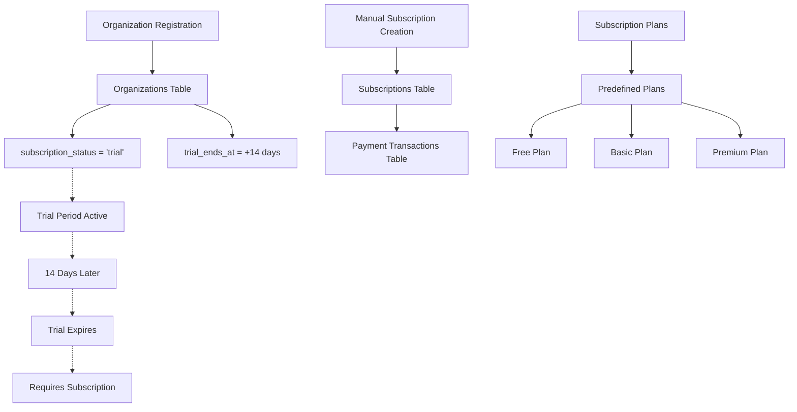

# Kapan Subscription dan Data Terkait Ter-Create?

## Overview

Berdasarkan analisis kode dan database, berikut adalah timeline kapan subscription dan data terkait ter-create dalam sistem Organization Self-Registration.

## 📊 Status Saat Ini

### ✅ Data yang Sudah Ter-Create
- **Organizations**: 11 records (dengan `subscription_status = 'trial'`)
- **Users**: 11 records (dengan role `org_admin`)
- **Email Verification Tokens**: 11 records
- **Organization Audit Logs**: 11 records

### ❌ Data yang Belum Ter-Create
- **Subscriptions**: 0 records
- **Subscription Plans**: 0 records
- **Payment Transactions**: 0 records

---

## 🔄 Timeline Subscription Creation

### 1. **SAAT ORGANIZATION REGISTRATION** (✅ Sudah Terjadi)

**Yang Ter-Create:**
```sql
-- Organizations table
INSERT INTO organizations (
    subscription_status = 'trial',           -- ✅ Set ke 'trial'
    trial_ends_at = now() + 14 days,        -- ✅ Trial 14 hari
    -- ... field lainnya
);
```

**Yang TIDAK Ter-Create:**
- ❌ Record di tabel `subscriptions`
- ❌ Record di tabel `subscription_plans`
- ❌ Record di tabel `payment_transactions`

### 2. **KAPAN SUBSCRIPTION RECORD TER-CREATE?**

Berdasarkan analisis kode, **subscription record TIDAK otomatis ter-create** saat organization registration. Subscription record hanya ter-create ketika:

#### A. **Manual Subscription Creation** (via API)
```php
// Dipanggil melalui SubscriptionController
POST /api/subscriptions
{
    "organization_id": "uuid",
    "plan_id": "uuid",
    "billing_cycle": "monthly",
    "unit_amount": 100000,
    "currency": "IDR"
}
```

#### B. **Trial to Paid Conversion**
Ketika organization upgrade dari trial ke paid plan.

#### C. **Admin Manual Assignment**
Ketika admin manually assign subscription plan ke organization.

---

## 🏗️ Arsitektur Subscription System

### Current Implementation



### Database Relationships

```sql
-- Organizations (1) ←→ (0..1) Subscriptions
organizations.id → subscriptions.organization_id

-- Subscriptions (1) ←→ (1) Subscription Plans
subscriptions.plan_id → subscription_plans.id

-- Subscriptions (1) ←→ (0..*) Payment Transactions
subscriptions.id → payment_transactions.subscription_id
```

---

## 📋 Subscription Plans Structure

### Tabel `subscription_plans`
```sql
CREATE TABLE subscription_plans (
    id UUID PRIMARY KEY,
    name VARCHAR(255),                    -- 'free', 'basic', 'premium'
    display_name VARCHAR(255),            -- 'Free Plan', 'Basic Plan'
    description TEXT,
    tier VARCHAR(50),                     -- 'free', 'basic', 'premium'
    price_monthly NUMERIC,                -- Harga bulanan
    price_quarterly NUMERIC,              -- Harga triwulan
    price_yearly NUMERIC,                 -- Harga tahunan
    currency VARCHAR(3),                  -- 'IDR', 'USD'
    max_agents INTEGER,                   -- Maksimal agents
    max_channels INTEGER,                 -- Maksimal channels
    max_knowledge_articles INTEGER,       -- Maksimal knowledge articles
    max_monthly_messages INTEGER,         -- Maksimal messages per bulan
    max_monthly_ai_requests INTEGER,      -- Maksimal AI requests per bulan
    max_storage_gb NUMERIC,               -- Maksimal storage (GB)
    max_api_calls_per_day INTEGER,        -- Maksimal API calls per hari
    features JSON,                        -- Fitur yang tersedia
    trial_days INTEGER,                   -- Hari trial
    is_popular BOOLEAN,                   -- Plan populer
    is_custom BOOLEAN,                    -- Custom plan
    sort_order INTEGER,                   -- Urutan tampilan
    status VARCHAR(20),                   -- 'active', 'inactive'
    created_at TIMESTAMP,
    updated_at TIMESTAMP
);
```

### Tabel `subscriptions`
```sql
CREATE TABLE subscriptions (
    id UUID PRIMARY KEY,
    organization_id UUID,                 -- FK ke organizations
    plan_id UUID,                         -- FK ke subscription_plans
    status VARCHAR(20),                   -- 'pending', 'active', 'cancelled'
    billing_cycle VARCHAR(20),            -- 'monthly', 'quarterly', 'yearly'
    current_period_start TIMESTAMP,       -- Mulai periode billing
    current_period_end TIMESTAMP,         -- Akhir periode billing
    trial_start TIMESTAMP,                -- Mulai trial
    trial_end TIMESTAMP,                  -- Akhir trial
    unit_amount NUMERIC,                  -- Harga per periode
    currency VARCHAR(3),                  -- Mata uang
    discount_amount NUMERIC,              -- Diskon
    tax_amount NUMERIC,                   -- Pajak
    payment_method_id VARCHAR(255),       -- ID payment method
    last_payment_date TIMESTAMP,          -- Tanggal pembayaran terakhir
    next_payment_date TIMESTAMP,          -- Tanggal pembayaran berikutnya
    cancel_at_period_end BOOLEAN,         -- Cancel di akhir periode
    canceled_at TIMESTAMP,                -- Tanggal cancel
    cancellation_reason TEXT,             -- Alasan cancel
    metadata JSON,                        -- Metadata tambahan
    created_at TIMESTAMP,
    updated_at TIMESTAMP
);
```

---

## 🚀 Kapan Subscription Ter-Create?

### 1. **Immediate (Saat Registration)** ❌
**TIDAK** - Subscription record tidak ter-create otomatis saat registration.

### 2. **Manual Creation** ✅
**YA** - Melalui API endpoint:
```bash
POST /api/subscriptions
{
    "organization_id": "uuid",
    "plan_id": "uuid",
    "billing_cycle": "monthly",
    "unit_amount": 100000,
    "currency": "IDR"
}
```

### 3. **Trial Conversion** ✅
**YA** - Ketika organization upgrade dari trial ke paid plan.

### 4. **Admin Assignment** ✅
**YA** - Ketika admin manually assign subscription.

---

## 🔧 Implementation yang Diperlukan

### 1. **Seed Subscription Plans**
```php
// database/seeders/SubscriptionPlanSeeder.php
public function run()
{
    SubscriptionPlan::create([
        'name' => 'free',
        'display_name' => 'Free Plan',
        'description' => 'Free plan with basic features',
        'tier' => 'free',
        'price_monthly' => 0,
        'price_quarterly' => 0,
        'price_yearly' => 0,
        'currency' => 'IDR',
        'max_agents' => 1,
        'max_channels' => 1,
        'max_knowledge_articles' => 10,
        'max_monthly_messages' => 1000,
        'max_monthly_ai_requests' => 500,
        'max_storage_gb' => 1,
        'max_api_calls_per_day' => 100,
        'features' => json_encode(['basic_chatbot', 'email_support']),
        'trial_days' => 14,
        'is_popular' => false,
        'is_custom' => false,
        'sort_order' => 1,
        'status' => 'active'
    ]);
}
```

### 2. **Auto-Create Free Subscription**
```php
// app/Services/OrganizationService.php
public function selfRegisterOrganization(array $data): array
{
    // ... existing code ...
    
    // Create organization
    $organization = $this->getModel()->create($organizationData);
    
    // Auto-create free subscription
    $this->createFreeSubscription($organization);
    
    // ... rest of the code ...
}

private function createFreeSubscription(Organization $organization): void
{
    $freePlan = SubscriptionPlan::where('name', 'free')->first();
    
    if ($freePlan) {
        Subscription::create([
            'organization_id' => $organization->id,
            'plan_id' => $freePlan->id,
            'status' => 'active',
            'billing_cycle' => 'monthly',
            'current_period_start' => now(),
            'current_period_end' => now()->addDays(14), // Trial period
            'trial_start' => now(),
            'trial_end' => now()->addDays(14),
            'unit_amount' => 0,
            'currency' => 'IDR',
            'discount_amount' => 0,
            'tax_amount' => 0,
            'metadata' => ['auto_created' => true, 'trial' => true]
        ]);
    }
}
```

### 3. **Trial Expiration Handler**
```php
// app/Console/Commands/HandleTrialExpiration.php
public function handle()
{
    $expiredTrials = Organization::where('subscription_status', 'trial')
        ->where('trial_ends_at', '<', now())
        ->get();
    
    foreach ($expiredTrials as $organization) {
        // Update organization status
        $organization->update([
            'subscription_status' => 'expired',
            'status' => 'suspended'
        ]);
        
        // Send notification
        $this->sendTrialExpiredNotification($organization);
    }
}
```

---

## 📊 Current vs Expected State

### Current State (Saat Ini)
```
Organizations: 11 records (subscription_status = 'trial')
Subscriptions: 0 records
Subscription Plans: 0 records
Payment Transactions: 0 records
```

### Expected State (Yang Diinginkan)
```
Organizations: 11 records (subscription_status = 'trial')
Subscriptions: 11 records (free plan, trial period)
Subscription Plans: 3+ records (free, basic, premium)
Payment Transactions: 0 records (karena masih trial)
```

---

## 🎯 Kesimpulan

### **Kapan Subscription Ter-Create?**

1. **Saat Registration**: ❌ **TIDAK** - Hanya set `subscription_status = 'trial'`
2. **Manual Creation**: ✅ **YA** - Via API endpoint
3. **Trial Conversion**: ✅ **YA** - Ketika upgrade ke paid plan
4. **Admin Assignment**: ✅ **YA** - Manual assignment oleh admin

### **Yang Perlu Diimplementasi:**

1. **Seed Subscription Plans** - Buat default plans (free, basic, premium)
2. **Auto-Create Free Subscription** - Otomatis buat subscription record saat registration
3. **Trial Expiration Handler** - Handle trial yang expired
4. **Payment Integration** - Integrasi dengan payment gateway
5. **Billing Automation** - Otomatis billing untuk paid plans

### **Current Gap:**
- Organization memiliki `subscription_status = 'trial'` tapi tidak ada record di tabel `subscriptions`
- Tidak ada subscription plans yang tersedia
- Tidak ada payment transactions

**System perlu di-enhance untuk membuat subscription records otomatis saat registration!** 🚀
