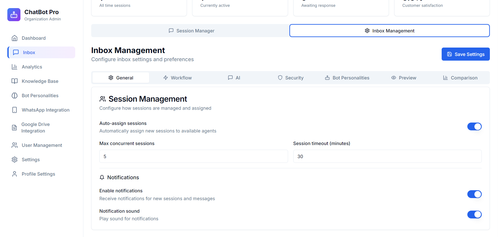
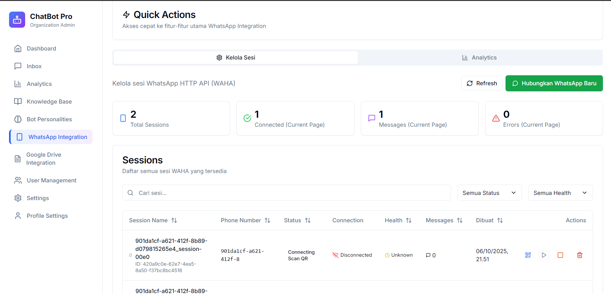
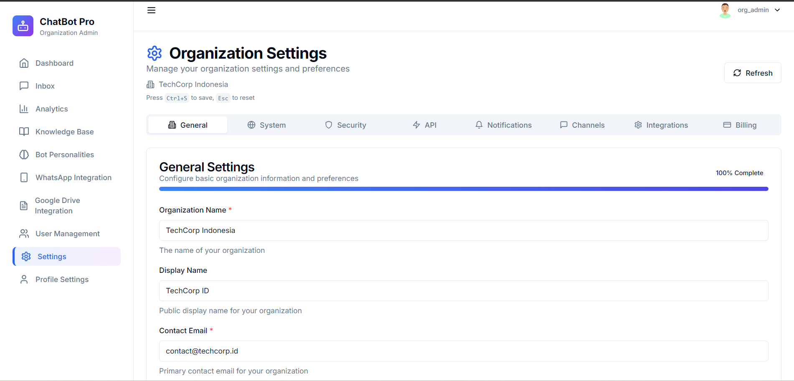

# Dokumentasi Fitur Organization Admin (Org Admin)

> **Role:** Organization Administrator
> 
> **Deskripsi:** Organization Admin memiliki akses penuh untuk mengelola seluruh aspek organisasi, termasuk user management, bot configuration, knowledge base, integrations, dan analytics.

---

## Daftar Isi

1. [Dashboard](#1-dashboard)
2. [Dashboard Analytics](#2-dashboard-analytics)
3. [Inbox Management](#3-inbox-management)
4. [Conversation Chat](#4-conversation-chat)
5. [Inbox Settings](#5-inbox-settings)
6. [Knowledge Base Management](#6-knowledge-base-management)
7. [Bot Personalities Management](#7-bot-personalities-management)
8. [WhatsApp Integration](#8-whatsapp-integration)
9. [User Management](#9-user-management)
10. [Organization Settings](#10-organization-settings)

---

## 1. Dashboard

**Screenshot:** `dashboard.png`


### Fitur:
- **Overview Metrics**: Menampilkan ringkasan performa chatbot secara real-time
- **Quick Access**: Akses cepat ke fitur-fitur utama
- **Recent Activities**: Aktivitas terbaru dalam organisasi
- **Status Monitoring**: Status koneksi dan integrasi aktif

### Alur Penggunaan:
1. **Login** → Org Admin credentials
2. **Dashboard Landing** → Overview metrics (total conversations, active users, response rate)
3. **Monitor Real-time** → Active status, ongoing conversations
4. **Quick Actions** → Navigate ke Inbox, Knowledge Base, Settings
5. **Review Activities** → Recent conversations, user activities, system events

---

## 2. Dashboard Analytics

**Screenshot:** `dashboard_analytics.png`


### Fitur:
- **Performance Charts**: Grafik performa chatbot (line, bar, pie charts)
- **Conversation Metrics**: Total conversations, avg response time, satisfaction rate
- **Filter Options**: Filter berdasarkan periode waktu (hari, minggu, bulan)
- **Export Data**: Export laporan dalam format CSV/PDF
- **Trend Analysis**: Identify patterns dan peak hours

### Alur Penggunaan:
1. **Access Analytics** → Click "Analytics" dari sidebar atau dashboard
2. **View Visualizations** → Charts showing performance data
3. **Filter Data** → Select time range (today, this week, this month, custom)
4. **Analyze Metrics** → Review KPIs (response time, resolution rate, CSAT)
5. **Compare Periods** → Compare current vs previous period
6. **Export Report** → Download data untuk external analysis

---

## 3. Inbox Management

**Screenshot:** `inbox.png`


### Fitur:
- **Conversation List**: Daftar semua percakapan aktif dan history
- **Filter & Search**: Filter by status, channel, agent; search by name/phone
- **Assignment**: Assign conversation ke team member
- **Bulk Actions**: Mark as read, assign multiple, close conversations
- **Status Indicators**: Visual badges (unread, assigned, resolved)

### Alur Penggunaan:
1. **Access Inbox** → Navigate dari dashboard atau sidebar
2. **View All Conversations** → List dengan preview dan status
3. **Search & Filter** → Find specific conversations atau filter by criteria
4. **Assign Conversations** → Assign ke available agents
5. **Monitor Status** → Track unassigned, active, waiting, resolved
6. **Bulk Operations** → Select multiple untuk batch actions

---

## 4. Conversation Chat

**Screenshot:** `conversation_chat.png`


### Fitur:
- **Full Chat Interface**: Complete message history dengan customer info
- **Customer Profile**: Name, contact, tags, previous conversations
- **Message Actions**: Reply, transfer, resolve, reopen
- **File Attachments**: Send/receive images, documents, videos
- **Internal Notes**: Add notes visible only to team
- **Bot/Human Toggle**: Switch between automated dan manual responses

### Alur Penggunaan:
1. **Open Conversation** → Click dari inbox list
2. **Review History** → See full conversation context
3. **Check Customer Info** → View profile, tags, previous interactions
4. **Reply or Intervene** → Take over dari bot jika needed
5. **Add Internal Notes** → Document important information
6. **Transfer** → Reassign ke agent lain atau department
7. **Resolve** → Mark as complete when issue resolved

---

## 5. Inbox Settings

**Screenshot:** `inbox_setting.png`



### Fitur:
- **Auto-Assignment Rules**: Configure automatic assignment logic
- **Business Hours**: Set operational hours per day
- **Auto-Reply**: Configure responses untuk outside hours
- **Priority Rules**: Set conversation priority criteria
- **SLA Configuration**: Define Service Level Agreement targets
- **Notification Settings**: Email, push, sound notifications

### Alur Penggunaan:
1. **Access Settings** → Click settings icon di inbox
2. **Configure Auto-Assignment**:
   - Enable/disable auto-assignment
   - Set rules (round-robin, skill-based, load-based)
   - Define agent availability criteria
3. **Set Business Hours**:
   - Define hours per day (Mon-Sun)
   - Set timezone
   - Mark holidays
4. **Configure Auto-Reply**:
   - Create template messages
   - Set triggers (outside hours, all busy)
5. **Define SLA**:
   - First response time target
   - Resolution time target
   - Priority-based SLAs
6. **Save Configuration** → Apply settings

---

## 6. Knowledge Base Management

### 6.1 Knowledge Base Index

**Screenshot:** `knowledge_base_index.png`


#### Fitur:
- **KB List**: All knowledge base entries dengan status
- **Search & Filter**: By name, tag, category, status
- **Usage Statistics**: View count, success rate per KB
- **Quick Actions**: Edit, delete, duplicate, activate/deactivate
- **Categories & Tags**: Organization dengan labels

#### Alur Penggunaan:
1. **Access KB Section** → From navigation menu
2. **View All Entries** → List of knowledge base items
3. **Search KB** → Find specific entries
4. **Filter** → By category, status, or date
5. **Check Statistics** → Usage metrics per entry
6. **Manage** → Edit, delete, atau activate/deactivate entries

---

### 6.2 Knowledge Base Create/Edit

**Screenshot:** `knowledge_base_create_edit.png`


#### Fitur:
- **Multiple Input Methods**: Upload file, paste text, import URL, manual entry
- **Content Editor**: Rich text editor untuk formatting
- **Metadata**: Title, description, category, tags, priority
- **Chunking Settings**: Configure content processing
- **Preview**: Test how bot will use the KB

#### Alur Penggunaan:
1. **Create New** → Click "Create KB" button
2. **Choose Input Method**:
   - Upload file (PDF, DOCX, TXT, CSV)
   - Paste text directly
   - Import from URL
   - Manual entry
3. **Add Content** → Input atau upload content
4. **Configure Metadata**:
   - Enter title (required)
   - Add description
   - Select category
   - Add tags untuk searchability
   - Set priority level
5. **Configure Processing**:
   - Set chunking strategy
   - Configure embedding settings
6. **Preview** → Test KB dengan sample queries
7. **Save** → Save & Activate atau Save as Draft

---

## 7. Bot Personalities Management

### 7.1 Bot Personalities Index

**Screenshot:** `bot_personalities_index.png`


#### Fitur:
- **Personalities List**: All bot personalities dengan active indicator
- **Template Gallery**: Pre-built personality templates
- **Quick Preview**: Preview personality configuration
- **Clone Feature**: Duplicate untuk customization
- **Version History**: Track changes over time

#### Alur Penggunaan:
1. **Access Personalities** → From sidebar menu
2. **View All Personalities** → List dengan status (active/inactive)
3. **Identify Active** → See which personality currently in use
4. **Search & Filter** → Find specific personalities
5. **Quick Actions** → Create, edit, delete, clone, activate

---

### 7.2 Create Bot Personality

**Screenshot:** `bot_personalities_create.png`


#### Fitur:
- **Basic Info**: Name, description, avatar
- **Personality Traits**: Tone, energy, emoji usage, response length
- **Behavior Settings**: Greetings, fallbacks, conversation style
- **System Prompts**: Custom prompts untuk guide behavior
- **Template Selection**: Start with pre-built templates

#### Alur Penggunaan:
1. **Click Create** → "Create New Personality" button
2. **Choose Template atau Start from Scratch**:
   - Select template (Customer Service, Sales, Technical)
   - Or start blank
3. **Configure Basic Info**:
   - Name: "Friendly Support Bot"
   - Description
   - Upload avatar
4. **Define Personality Traits**:
   - Tone: Formal ↔ Casual (slider)
   - Energy: Reserved ↔ Enthusiastic
   - Emoji usage: None/Minimal/Moderate/Frequent
   - Response length: Concise/Moderate/Detailed
5. **Configure Behavior**:
   - Greeting message template
   - Fallback responses
   - Conversation flow preferences
6. **System Prompts** (Advanced):
   - Write custom system prompt
   - Define do's and don'ts
7. **Test** → Try personality dengan sample conversations
8. **Save** → Save & Activate atau Save as Draft

---

### 7.3 Bot Personality Detail

**Screenshot:** `bot_personalities_detail.png`


#### Fitur:
- **Complete Configuration**: All personality settings displayed
- **Performance Metrics**: Satisfaction scores, success rate when using this personality
- **Sample Conversations**: Example interactions
- **A/B Test Results**: Comparison data jika tested
- **Version History**: Track changes over time

#### Alur Penggunaan:
1. **Open Detail** → Click personality dari list
2. **Review Configuration** → All settings organized dalam sections
3. **Check Performance**:
   - User satisfaction scores
   - Conversation success rate
   - Avg conversation length
   - Common feedback
4. **View Samples** → Example conversations menggunakan personality ini
5. **Analyze A/B Tests** → If multiple personalities tested
6. **Actions** → Edit, Clone, Activate, Delete

---

### 7.4 Update Bot Personality

**Screenshot:** `bot_personalities_update.png`


#### Fitur:
- **Edit Form**: Pre-filled dengan current values
- **Change Tracking**: Highlight modified fields
- **Preview Changes**: See impact before saving
- **Version Control**: Create new version atau update existing

#### Alur Penggunaan:
1. **Access Edit** → Click "Edit" dari detail page
2. **Modify Settings**:
   - Update traits, behavior, prompts
   - Adjust any configuration
3. **Preview Changes** → Test dengan sample conversations
4. **Compare** → Current vs new configuration
5. **Save** → Update version atau Save as New
6. **Apply** → Changes take effect immediately jika personality active

---

## 8. WhatsApp Integration

### 8.1 WhatsApp Integration Index

**Screenshot:** `whatsapp_integration_index.png`



#### Fitur:
- **Connected Accounts**: List semua WhatsApp accounts
- **Account Status**: Online/offline, connection health
- **Connection Method**: WhatsApp Business API atau Web
- **Account Info**: Phone number, display name, profile picture
- **Message Statistics**: Stats per account
- **Add New Account**: Connect additional WhatsApp numbers

#### Alur Penggunaan:
1. **Access Integration** → From sidebar "Integrations" > "WhatsApp"
2. **View Connected Accounts** → List dengan status
3. **Monitor Health** → Check connection status, last active
4. **View Statistics** → Messages sent/received per account
5. **Manage** → Disconnect, reconnect, configure settings
6. **Add New** → Connect additional WhatsApp account

---

### 8.2 QR Code Scan (WhatsApp Connection)

**Screenshot:** `qr_code_scan.png`


#### Fitur:
- **QR Code Display**: Large QR code untuk scanning
- **Auto-Refresh**: QR regenerates setiap beberapa detik
- **Connection Instructions**: Step-by-step guide
- **Real-time Status**: Connection progress indicator
- **Alternative Methods**: Link ke WhatsApp Business API setup

#### Alur Penggunaan:
1. **Start Connection** → Click "Add WhatsApp Account"
2. **Choose Method**:
   - WhatsApp Web (QR Code) - quick setup
   - WhatsApp Business API - enterprise solution
3. **For QR Code Method**:
   - System displays QR code
   - Follow on-screen instructions:
     1. Open WhatsApp on smartphone
     2. Tap Menu > Linked Devices
     3. Tap "Link a Device"
     4. Scan displayed QR code
4. **Wait for Connection** → Status shows "Connecting..."
5. **Success** → Account connected, redirect to settings
6. **If Failed** → New QR code generated, try again

**For WhatsApp Business API:**
1. Click "Use Business API" instead
2. Enter phone number
3. Input API credentials
4. Configure webhook
5. Verify connection
6. Complete setup

---

## 9. User Management

### 9.1 User Management Index

**Screenshot:** `user_management_index.png`


#### Fitur:
- **User List**: All users dalam organization
- **User Info**: Name, email, role, status, last login
- **Search & Filter**: By name, email, role, status
- **Bulk Actions**: Multiple user operations
- **User Statistics**: Total, active, inactive, pending invitations
- **Quick Actions**: Edit, view detail, deactivate, resend invitation

#### Alur Penggunaan:
1. **Access User Management** → From sidebar "Users"
2. **View All Users** → Table dengan user information
3. **Overview Stats** → Total users, active, inactive, pending
4. **Search User** → By name atau email
5. **Filter** → By role, status, department
6. **Sort** → By name, email, join date, last login
7. **Quick Actions** → Edit, deactivate, reset password, delete
8. **Bulk Operations** → Select multiple untuk batch actions
9. **Create New** → Click "Invite User" atau "Create User"

---

### 9.2 User Management Detail

**Screenshot:** `user_management_detail.png`


#### Fitur:
- **User Profile**: Photo, name, email, phone, role, status
- **Activity Log**: History of user activities
- **Performance Metrics**: (For Agents) Conversations handled, response time, satisfaction
- **Permissions Detail**: Detailed view of user permissions
- **Session Information**: Active sessions dan devices
- **Action Buttons**: Edit, deactivate, reset password, delete

#### Alur Penggunaan:
1. **Open Detail** → Click user dari list
2. **View Profile** → Complete user information
3. **Review Role & Permissions**:
   - Assigned role
   - Detailed permissions list
   - Access level per feature
4. **Check Activity Log**:
   - Recent actions
   - Login history
   - Conversations handled (for agents)
5. **View Performance** (For Agents):
   - Total conversations
   - Avg response time
   - Customer satisfaction scores
6. **Check Sessions**:
   - Active devices
   - Last login details
   - IP addresses
7. **Take Actions**:
   - Edit user info
   - Change role
   - Reset password
   - Deactivate account
   - Delete user

---

### 9.3 User Management Create

**Screenshot:** `user_management_create.png`


#### Fitur:
- **User Information Form**: Name, email, phone, photo
- **Role Selection**: Org Admin, Agent, Viewer, Custom
- **Permission Configuration**: Customize permissions jika needed
- **Team Assignment**: Assign ke team atau department
- **Invitation Settings**: Send immediately atau later, custom message
- **Bulk Import**: Import multiple users via CSV

#### Alur Penggunaan:
1. **Click Create** → "Create User" atau "Invite User" button
2. **Fill Basic Info**:
   - Full name (required)
   - Email address (required, unique)
   - Phone number (optional)
   - Upload photo (optional)
3. **Select Role**:
   - Org Admin (full access)
   - Agent (handle conversations)
   - Viewer (read-only)
   - Custom (custom permissions)
4. **Configure Permissions** (If Custom):
   - Select specific permissions
   - Define access level per feature
5. **Team Assignment**:
   - Select department/team
   - Set as team leader (optional)
6. **Invitation Options**:
   - Send invitation email immediately
   - Generate link untuk manual sending
   - Create account dengan temporary password
   - Customize invitation message
7. **Review** → Check all information
8. **Submit** → Create & Send Invitation
9. **Confirmation** → User created, invitation sent

**For Bulk Import:**
1. Click "Bulk Import"
2. Download CSV template
3. Fill template dengan user data
4. Upload completed CSV
5. Review preview
6. Confirm import
7. System creates users dan sends invitations

---

### 9.4 User Management Edit

**Screenshot:** `user_management_edit.png`


#### Fitur:
- **Edit Form**: Pre-filled dengan current user data
- **Editable Fields**: Name, email, phone, photo, role, permissions, status
- **Password Reset**: Option untuk reset password
- **Change Tracking**: Track modifications untuk audit
- **Validation**: Real-time input validation

#### Alur Penggunaan:
1. **Access Edit** → Click "Edit" dari detail atau list page
2. **Modify Information**:
   - Update name, email, phone
   - Change profile photo
   - Update role
   - Modify permissions (jika custom role)
   - Change team assignment
   - Update status (active/inactive)
3. **Additional Actions**:
   - Force password change on next login
   - Require 2FA
   - Set account expiration
4. **Reset Password** → Send password reset email
5. **Review Changes** → System highlights modified fields
6. **Confirm** → If changing critical settings (role, permissions)
7. **Save** → Apply changes
8. **Notification** → User notified jika needed
9. **Confirmation** → Changes saved, audit log updated

---

## 10. Organization Settings

**Screenshot:** `organization_setting.png`



### Fitur:
- **Organization Profile**: Name, logo, branding, timezone, language
- **Subscription & Billing**: Plan details, usage, payment info, invoices
- **Security Settings**: 2FA policy, password policy, session timeout, IP whitelist
- **API Keys Management**: Generate, view, revoke API keys
- **Notification Preferences**: Email, SMS, webhook configurations
- **Integration Settings**: Third-party integrations (CRM, Help Desk, Analytics)
- **Data & Privacy**: Data retention, GDPR compliance, export options

### Alur Penggunaan:

1. **Access Settings** → Click "Settings" dari profile menu atau sidebar

2. **Organization Profile**:
   - Update organization name
   - Upload/change logo
   - Set brand colors
   - Select timezone
   - Set default language
   - Update contact information

3. **Subscription & Billing**:
   - **View Current Plan**:
     - Plan name (Professional)
     - Features included
     - Usage limits dan current usage
   - **Usage Statistics**:
     - Messages: 15,000 / 20,000
     - Storage: 2.5GB / 5GB
     - Active agents: 8 / 10
   - **Billing Info**:
     - Current billing cycle
     - Next billing date
     - Payment method
     - View/download invoices
   - **Upgrade/Downgrade**:
     - Compare plans
     - Select new plan
     - Process upgrade

4. **Security Settings**:
   - **Two-Factor Authentication**:
     - Enable/disable 2FA for all users
     - Make 2FA mandatory
   - **Password Policy**:
     - Set minimum length
     - Require special characters
     - Set expiration period
   - **Session Management**:
     - Set timeout duration
     - Force logout after inactivity
   - **IP Whitelist**:
     - Add allowed IP addresses
     - Block all other IPs
   - **API Keys**:
     - Generate new keys
     - View existing keys
     - Revoke keys
     - Set permissions dan expiration

5. **Notification Preferences**:
   - **Email Notifications**:
     - Enable/disable types
     - Set recipients
     - Configure frequency
   - **SMS Notifications** (if available)
   - **Webhooks**:
     - Add webhook URLs
     - Select trigger events
     - Configure retry logic
     - View webhook logs

6. **Integration Settings**:
   - **Third-Party Integrations**:
     - Connect CRM (Salesforce, HubSpot)
     - Connect Help Desk (Zendesk)
     - Connect Analytics (Google Analytics)
     - Configure OAuth connections
   - **API Configuration**:
     - View API endpoints
     - Configure rate limits
     - Access documentation

7. **Data & Privacy**:
   - **Data Retention**:
     - Set retention period untuk conversations
     - Configure automatic deletion
   - **GDPR Compliance**:
     - Enable data anonymization
     - Configure consent management
   - **Export Data**:
     - Export organization data
     - Select data types
     - Choose format (JSON, CSV)
     - Download exports

8. **Save Configuration** → Apply changes
9. **Confirmation** → Settings updated successfully

---

## Summary Flow Diagram

```
┌─────────────────────────────────────────────────────────────┐
│                      ORG ADMIN LOGIN                         │
└──────────────────────┬──────────────────────────────────────┘
                       │
                       ▼
┌─────────────────────────────────────────────────────────────┐
│                        DASHBOARD                             │
│  • Overview Metrics  • Analytics  • Quick Actions            │
└──┬────────┬────────┬────────┬────────┬────────┬────────┬───┘
   │        │        │        │        │        │        │
   │        │        │        │        │        │        │
   ▼        ▼        ▼        ▼        ▼        ▼        ▼
┌─────┐┌────────┐┌──────┐┌──────┐┌─────────┐┌──────┐┌──────┐
│Inbox││Knowledge││Bot   ││WhatsApp││User   ││Org   ││Analytics│
│     ││Base    ││Pers  ││Integr ││Mgmt   ││Settings││       │
└─────┘└────────┘└──────┘└──────┘└─────────┘└──────┘└──────┘
```

---

## Org Admin Responsibilities

✅ **Primary Responsibilities:**
- Configure dan manage chatbot personalities
- Manage knowledge base content
- Monitor conversation performance via analytics
- Manage team members (agents)
- Configure integrations (WhatsApp, etc.)
- Set organization policies dan settings
- Monitor usage dan subscription status
- Ensure data security dan compliance

✅ **Best Practices:**
1. **Knowledge Base**: Keep KB updated dan relevant
2. **Bot Personalities**: Test personalities before activating
3. **User Management**: Assign appropriate roles dan permissions
4. **Integrations**: Regularly check WhatsApp connection health
5. **Analytics**: Review performance metrics weekly
6. **Security**: Enable 2FA dan enforce strong password policy
7. **Data**: Regular backups dan compliance checks
8. **Training**: Ensure agents have proper training dan access

---

**Version:** 1.0  
**Last Updated:** October 8, 2025  
**Role:** Organization Administrator  
**Document Type:** Feature Documentation
