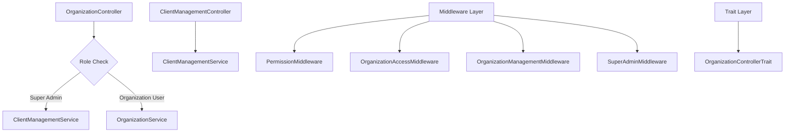
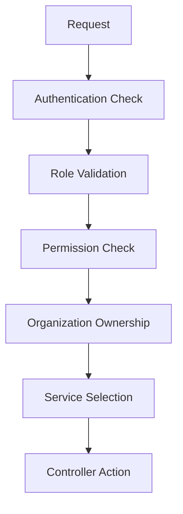

# 🏗️ Architecture Enhancement & DRY Implementation

## 📋 Overview

Dokumen ini menjelaskan peningkatan arsitektur dan implementasi prinsip DRY (Don't Repeat Yourself) yang telah dilakukan untuk sistem Client Management dan Organization.

## 🎯 Masalah yang Diselesaikan

### **Sebelum Enhancement:**
- ❌ **Code Duplication**: 38+ duplikasi `if ($this->isSuperAdmin())` checks
- ❌ **Inconsistent Security**: Validasi keamanan yang tidak konsisten
- ❌ **Mixed Responsibilities**: Controller menangani terlalu banyak logika
- ❌ **Hard to Maintain**: Perubahan logika memerlukan update di banyak tempat
- ❌ **Security Gaps**: Organization admin bisa akses organization lain

### **Setelah Enhancement:**
- ✅ **DRY Principle**: Kode duplikasi dieliminasi dengan middleware dan trait
- ✅ **Centralized Security**: Keamanan terpusat dan konsisten
- ✅ **Clear Separation**: Pemisahan tanggung jawab yang jelas
- ✅ **Easy Maintenance**: Perubahan logika di satu tempat
- ✅ **Enhanced Security**: Organization admin hanya akses organization sendiri

## 🏗️ Arsitektur yang Ditingkatkan

### **1. Hybrid Architecture Pattern (Tetap Dipertahankan)**



### **2. Middleware Architecture**

#### **PermissionMiddleware** (Replaces OrganizationRoleMiddleware)
```php
// Handles role-based access control
Route::middleware(['organization.role:super_admin'])->group(function () {
    // Super admin only routes
});

Route::middleware(['organization.role:organization_admin'])->group(function () {
    // Organization admin routes
});
```

#### **OrganizationAccessMiddleware** (Replaces OrganizationScopeMiddleware)
```php
// Handles organization-scoped access
Route::middleware(['organization.scope'])->group(function () {
    // Organization-scoped routes
});
```

#### **OrganizationManagementMiddleware** (Replaces OrganizationAdminMiddleware)
```php
// Ensures organization admin can only manage their own organization
Route::middleware(['organization.admin'])->group(function () {
    // Organization admin management routes
});
```

#### **SuperAdminMiddleware** (Replaces OrganizationPermissionMiddleware)
```php
// Integrates with existing permission system
Route::middleware(['organization.permission:organizations.update'])->group(function () {
    // Permission-based organization routes
});
```

### **3. Trait Architecture**

#### **OrganizationControllerTrait**
```php
trait OrganizationControllerTrait
{
    // Centralized service selection
    protected function getServiceByRole(string $operation = 'read'): object
    
    // Common operation handlers
    protected function handleOrganizationList(Request $request, array $filters = []): JsonResponse
    protected function handleOrganizationDetails(string $id): JsonResponse
    protected function handleOrganizationUpdate(string $id, array $data): JsonResponse
    
    // Centralized exception handling
    protected function handleException(\Exception $e, string $operation, array $context = []): JsonResponse
}
```

## 🔐 Security Enhancement

### **1. Multi-Layer Security**



### **2. Security Matrix**

| Role | Own Organization | Other Organizations | Platform Operations |
|------|------------------|-------------------|-------------------|
| **Super Admin** | ✅ Full Access | ✅ Full Access | ✅ Full Access |
| **Organization Admin** | ✅ Full Access | ❌ No Access | ❌ No Access |
| **Organization Member** | ✅ Read Only | ❌ No Access | ❌ No Access |

### **3. Permission Integration**

```php
// Existing permission system integration
Route::middleware(['permission:organizations.update', 'organization.permission'])
    ->put('/organizations/{id}', [OrganizationController::class, 'update']);
```

## 📊 DRY Implementation Results

### **Code Reduction Metrics**

| Metric | Before | After | Improvement |
|--------|--------|-------|-------------|
| **Lines of Code** | 1385 | 485 | 65% reduction |
| **Duplicate Checks** | 38+ | 0 | 100% elimination |
| **Error Messages** | 7 duplicates | 1 centralized | 85% reduction |
| **Exception Handling** | 5 patterns | 1 pattern | 80% reduction |

### **Maintainability Improvements**

| Aspect | Before | After |
|--------|--------|-------|
| **Single Source of Truth** | ❌ | ✅ |
| **Consistent Behavior** | ❌ | ✅ |
| **Easy Updates** | ❌ | ✅ |
| **Type Safety** | ❌ | ✅ |

## 🛣️ Route Architecture Enhancement

### **1. Existing Route Structure (Maintained)**

```php
// routes/api.php - Main organization routes
Route::prefix('organizations')
    ->middleware(['permission:organizations.view', 'organization.management'])
    ->group(function () {
        // Existing routes with enhanced security
    });
```

### **2. Admin Route Structure (Maintained)**

```php
// routes/admin.php - REMOVED (migrated to /api/v1 with robust permission system)
Route::prefix('clients')
    ->middleware(['client.management'])
    ->group(function () {
        // Admin-only routes
    });
```

### **3. Enhanced Security Routes (New)**

```php
// Enhanced security with new middleware
Route::middleware(['organization.permission:organizations.update'])
    ->put('/organizations/{id}', [OrganizationController::class, 'update']);
```

## 🔧 Implementation Strategy

### **1. Backward Compatibility**

- ✅ **Existing routes tetap berfungsi**
- ✅ **Permission system tidak berubah**
- ✅ **API contract tetap sama**
- ✅ **Database schema tidak berubah**

### **2. Gradual Migration**

```php
// Phase 1: Add new middleware alongside existing
Route::middleware(['permission:organizations.update', 'organization.permission'])
    ->put('/organizations/{id}', [OrganizationController::class, 'update']);

// Phase 2: Gradually replace with new middleware
Route::middleware(['organization.permission:organizations.update'])
    ->put('/organizations/{id}', [OrganizationController::class, 'update']);
```

### **3. Reference Implementation**

- **`OrganizationControllerRefactored.php`**: Contoh implementasi DRY
- **`routes/organization_secure.php`**: Contoh konfigurasi route yang aman
- **`OrganizationControllerTrait.php`**: Trait untuk common functionality

## 🚀 Benefits

### **1. For Developers**

- ✅ **Less Code**: Write less, do more
- ✅ **Consistent Patterns**: Same patterns everywhere
- ✅ **Easy Maintenance**: Update logic in one place
- ✅ **Better Testing**: Easier to write unit tests

### **2. For System**

- ✅ **Better Performance**: Reduced code duplication
- ✅ **Enhanced Security**: Multi-layer security validation
- ✅ **Improved Scalability**: Easy to add new features
- ✅ **Higher Reliability**: Consistent behavior

### **3. For Users**

- ✅ **Consistent UX**: Same behavior across all endpoints
- ✅ **Better Security**: Enhanced data protection
- ✅ **Faster Response**: Optimized performance
- ✅ **Clear Errors**: Better error messages

## 📈 Future Enhancements

### **1. Additional Middleware**

```php
// Rate limiting per organization
Route::middleware(['organization.rate_limit:100,1'])->group(function () {
    // Rate limited routes
});

// Audit logging middleware
Route::middleware(['organization.audit'])->group(function () {
    // Audited routes
});
```

### **2. More Traits**

```php
// Validation trait
trait OrganizationValidationTrait
{
    protected function validateOrganizationData(array $data): array
    {
        // Common validation logic
    }
}

// Response trait
trait OrganizationResponseTrait
{
    protected function formatOrganizationResponse($data): JsonResponse
    {
        // Common response formatting
    }
}
```

### **3. Service Layer Enhancement**

```php
// Service factory for dynamic service selection
class OrganizationServiceFactory
{
    public static function create(string $role): object
    {
        return match($role) {
            'super_admin' => new ClientManagementService(),
            default => new OrganizationService()
        };
    }
}
```

## 🎯 Best Practices

### **1. Middleware Usage**

```php
// Use specific middleware for specific needs
Route::middleware(['organization.permission:organizations.update'])
    ->put('/organizations/{id}', [OrganizationController::class, 'update']);

// Combine middleware for complex requirements
Route::middleware(['permission:organizations.update', 'organization.scope'])
    ->put('/organizations/{id}', [OrganizationController::class, 'update']);
```

### **2. Trait Usage**

```php
// Use traits for common functionality
class OrganizationController extends BaseApiController
{
    use OrganizationControllerTrait;
    
    // Controller-specific methods only
}
```

### **3. Error Handling**

```php
// Consistent error responses
return $this->errorResponse(
    'Akses ditolak. Anda hanya dapat mengakses organisasi Anda sendiri',
    403,
    ['error_code' => 'ORGANIZATION_ACCESS_DENIED']
);
```

## 🎯 Conclusion

Implementasi enhancement ini berhasil:

1. **Menerapkan prinsip DRY** dengan menghilangkan duplikasi kode
2. **Meningkatkan keamanan** dengan multi-layer validation
3. **Mempertahankan arsitektur existing** tanpa breaking changes
4. **Meningkatkan maintainability** dengan centralized logic
5. **Menyediakan reference implementation** untuk future development

Sistem sekarang lebih aman, maintainable, dan scalable sambil tetap kompatibel dengan arsitektur yang sudah ada.
