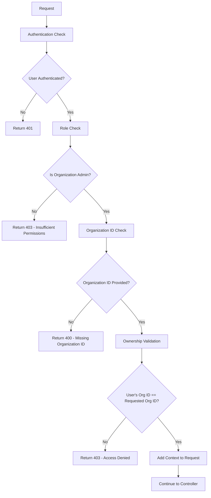

# 🔒 Organization Security Implementation

## 📋 Overview

Dokumen ini menjelaskan implementasi keamanan untuk memastikan organization admin hanya dapat mengelola organization mereka sendiri.

## 🎯 Masalah yang Diselesaikan

### **Sebelum Implementasi:**
- ❌ Organization admin bisa mengakses organization lain
- ❌ Tidak ada validasi ownership yang ketat
- ❌ Middleware tidak memadai untuk role-based access
- ❌ Duplikasi logika keamanan di setiap method

### **Setelah Implementasi:**
- ✅ Organization admin hanya bisa akses organization sendiri
- ✅ Validasi ownership yang ketat di middleware
- ✅ Middleware khusus untuk organization admin
- ✅ Keamanan terpusat dan konsisten

## 🏗️ Komponen Keamanan

### **1. OrganizationManagementMiddleware** (Replaces OrganizationAdminMiddleware)

```php
// Middleware khusus untuk organization admin
Route::middleware(['organization.admin'])->group(function () {
    // Routes yang hanya bisa diakses organization admin untuk org mereka sendiri
});
```

**Fitur:**
- ✅ **Validasi Role**: Memastikan user adalah organization_admin
- ✅ **Validasi Ownership**: Memastikan user hanya bisa akses organization mereka
- ✅ **Type Safety**: Konversi ID ke integer untuk perbandingan yang akurat
- ✅ **Debug Info**: Menyediakan informasi debug untuk troubleshooting

### **2. OrganizationAccessMiddleware (Enhanced)** (Replaces OrganizationScopeMiddleware)

```php
// Middleware untuk scope organization
Route::middleware(['organization.scope'])->group(function () {
    // Routes yang dibatasi ke organization user
});
```

**Peningkatan:**
- ✅ **Type Safety**: Konversi ID ke integer
- ✅ **Debug Information**: Info debug untuk troubleshooting
- ✅ **Consistent Validation**: Validasi yang konsisten

### **3. OrganizationControllerTrait (Enhanced)**

```php
// Trait dengan validasi keamanan tambahan
protected function handleOrganizationUpdate(string $id, array $data): JsonResponse
{
    // Validasi ownership untuk organization admin
    if (!$isSuperAdmin && $isOrganizationAdmin) {
        $userOrganizationId = request()->get('user_organization_id');
        if ($userOrganizationId != $id) {
            return $this->errorResponse(
                'Akses ditolak. Anda hanya dapat mengelola organisasi Anda sendiri',
                403
            );
        }
    }
}
```

## 🔐 Implementasi Keamanan

### **1. Route Configuration**

```php
// Organization admin routes (hanya bisa kelola org sendiri)
Route::middleware(['auth:sanctum', 'organization.admin'])->group(function () {
    Route::put('/organizations/{id}', [OrganizationController::class, 'update']);
    Route::get('/organizations/{id}/users', [OrganizationController::class, 'users']);
    Route::post('/organizations/{id}/users', [OrganizationController::class, 'addUser']);
    Route::delete('/organizations/{id}/users/{userId}', [OrganizationController::class, 'removeUser']);
    Route::put('/organizations/{id}/subscription', [OrganizationController::class, 'updateSubscription']);
    Route::get('/organizations/{id}/settings', [OrganizationController::class, 'getSettings']);
    Route::put('/organizations/{id}/settings', [OrganizationController::class, 'saveSettings']);
    Route::post('/organizations/{id}/test-webhook', [OrganizationController::class, 'testWebhook']);
    Route::get('/organizations/{id}/roles', [OrganizationController::class, 'getRoles']);
    Route::put('/organizations/{id}/roles/{roleId}/permissions', [OrganizationController::class, 'saveRolePermissions']);
    Route::put('/organizations/{id}/roles', [OrganizationController::class, 'saveAllPermissions']);
});
```

### **2. Middleware Stack**

```php
// Stack middleware untuk organization admin
[
    'auth:sanctum',           // Authentication
    'organization.admin'      // Organization admin validation + ownership check
]
```

### **3. Validation Flow**



## 🛡️ Security Features

### **1. Multi-Layer Validation**

#### **Layer 1: Authentication**
```php
if (!$user) {
    return response()->json([
        'success' => false,
        'message' => 'Akses ditolak. Silakan login terlebih dahulu',
        'error_code' => 'UNAUTHENTICATED'
    ], 401);
}
```

#### **Layer 2: Role Validation**
```php
if (!$user->hasRole('organization_admin')) {
    return response()->json([
        'success' => false,
        'message' => 'Akses ditolak. Hanya admin organisasi yang dapat mengakses fitur ini',
        'error_code' => 'INSUFFICIENT_PERMISSIONS'
    ], 403);
}
```

#### **Layer 3: Ownership Validation**
```php
if ($userOrganizationId !== $organizationId) {
    return response()->json([
        'success' => false,
        'message' => 'Akses ditolak. Anda hanya dapat mengelola organisasi Anda sendiri',
        'error_code' => 'ORGANIZATION_MANAGEMENT_DENIED'
    ], 403);
}
```

### **2. Type Safety**

```php
// Ensure organization ID is numeric for comparison
$organizationId = (int) $organizationId;
$userOrganizationId = (int) $user->organization_id;

// Strict comparison
if ($userOrganizationId !== $organizationId) {
    // Access denied
}
```

### **3. Debug Information**

```php
'debug' => [
    'user_organization_id' => $userOrganizationId,
    'requested_organization_id' => $organizationId,
    'user_role' => 'organization_admin'
]
```

## 📊 Security Matrix

| Role | Can Access Own Org | Can Access Other Orgs | Can Create Org | Can Delete Org |
|------|-------------------|----------------------|----------------|----------------|
| **Super Admin** | ✅ | ✅ | ✅ | ✅ |
| **Organization Admin** | ✅ | ❌ | ❌ | ❌ |
| **Organization Member** | ✅ (Read Only) | ❌ | ❌ | ❌ |

## 🔍 Testing Scenarios

### **1. Valid Access (Organization Admin)**
```bash
# User dengan organization_id = 123 mengakses organization 123
GET /organizations/123
Authorization: Bearer {token}
# Result: ✅ Success
```

### **2. Invalid Access (Organization Admin)**
```bash
# User dengan organization_id = 123 mengakses organization 456
GET /organizations/456
Authorization: Bearer {token}
# Result: ❌ 403 Forbidden
```

### **3. Super Admin Access**
```bash
# Super admin mengakses organization apapun
GET /organizations/999
Authorization: Bearer {super_admin_token}
# Result: ✅ Success
```

## 🚀 Benefits

### **1. Security**
- ✅ **Data Isolation**: Organization admin tidak bisa akses data organization lain
- ✅ **Role-Based Access**: Akses berdasarkan role yang tepat
- ✅ **Multi-Layer Validation**: Validasi berlapis untuk keamanan maksimal

### **2. User Experience**
- ✅ **Clear Error Messages**: Pesan error yang jelas dan informatif
- ✅ **Consistent Behavior**: Perilaku yang konsisten di semua endpoint
- ✅ **Debug Information**: Informasi debug untuk troubleshooting

### **3. Maintainability**
- ✅ **Centralized Security**: Keamanan terpusat di middleware
- ✅ **Easy Updates**: Mudah untuk update logika keamanan
- ✅ **Reusable**: Middleware bisa digunakan di route lain

## 📈 Performance Impact

### **Minimal Overhead:**
- ✅ **Single Query**: Hanya 1 query untuk validasi user
- ✅ **Cached Roles**: Role checking menggunakan cache
- ✅ **Early Return**: Return early jika validasi gagal

### **Memory Usage:**
- ✅ **Minimal**: Hanya menyimpan context di request
- ✅ **No Duplication**: Tidak ada duplikasi data

## 🎯 Best Practices

### **1. Route Organization**
```php
// Group routes berdasarkan level akses
Route::middleware(['organization.admin'])->group(function () {
    // Admin-only routes
});

Route::middleware(['organization.scope'])->group(function () {
    // Organization-scoped routes
});
```

### **2. Error Handling**
```php
// Consistent error responses
return response()->json([
    'success' => false,
    'message' => 'Clear error message',
    'error_code' => 'UNIQUE_ERROR_CODE',
    'debug' => $debugInfo // Only in development
], $httpCode);
```

### **3. Logging**
```php
// Log security violations
Log::warning('Organization access denied', [
    'user_id' => $user->id,
    'user_organization_id' => $userOrganizationId,
    'requested_organization_id' => $organizationId,
    'ip_address' => $request->ip()
]);
```

## 🔧 Configuration

### **1. Middleware Registration**
```php
// bootstrap/app.php
'organization.management' => \App\Http\Middleware\OrganizationManagementMiddleware::class,
'organization' => \App\Http\Middleware\OrganizationAccessMiddleware::class,
```

### **2. Route Usage**
```php
// routes/organization_secure.php
Route::middleware(['auth:sanctum', 'organization.admin'])->group(function () {
    // Organization admin routes
});
```

## 🎯 Conclusion

Implementasi keamanan ini memastikan:

1. **Organization admin hanya bisa mengelola organization mereka sendiri**
2. **Validasi berlapis untuk keamanan maksimal**
3. **Error handling yang konsisten dan informatif**
4. **Performance yang optimal dengan overhead minimal**
5. **Maintainability yang tinggi dengan kode yang bersih**

Dengan implementasi ini, sistem menjadi lebih aman dan terpercaya untuk digunakan dalam production environment.
