# 🚀 Unified Authentication System Implementation

## 📋 Overview

Sistem authentication yang menggabungkan **JWT + Sanctum + Refresh Token** untuk memberikan keamanan maksimal dengan performansi optimal.

## 🎯 Features

### ✅ **Dual Token Strategy**
- **JWT Token**: Fast, stateless, expires in 1 hour
- **Sanctum Token**: Reliable, database-backed, expires in 1 year
- **Refresh Token**: Auto-renew JWT, expires in 7 days

### ✅ **Automatic Fallback**
- JWT expired → Sanctum fallback
- Background JWT refresh
- Seamless user experience

### ✅ **Security Features**
- Token rotation
- Rate limiting
- Session management
- Audit logging

## 🏗️ Architecture


## 📁 File Structure

```
app/
├── Http/
│   ├── Controllers/
│   │   └── Api/
│   │       └── AuthController.php          # Unified auth controller
│   └── Middleware/
│       ├── JwtAuthMiddleware.php          # Legacy JWT middleware
│       └── UnifiedAuthMiddleware.php      # 🆕 Unified auth middleware
├── Services/
│   └── AuthService.php                    # Enhanced with refresh tokens
└── Http/Resources/
    └── Auth/
        └── AuthResource.php               # Updated response format

routes/
├── auth.php                              # 🆕 Unified auth routes
└── api.php                               # Updated to use unified auth

database/migrations/
└── 2024_01_01_000000_create_refresh_tokens_table.php  # 🆕 Refresh tokens

frontend/src/
├── services/
│   └── AuthService.jsx                   # 🆕 Smart token management
├── contexts/
│   └── AuthContext.jsx                   # 🆕 React auth context
└── components/
    ├── Login.jsx                         # 🆕 Login component
    └── ProtectedRoute.jsx                # 🆕 Route protection
```

## 🔧 Backend Implementation

### 1. **UnifiedAuthMiddleware**

```php
// Strategy: Try JWT first (fast), fallback to Sanctum (reliable)
public function handle(Request $request, Closure $next): Response
{
    // Try JWT authentication first
    $jwtUser = $this->authenticateWithJWT($request);
    if ($jwtUser) {
        Auth::setUser($jwtUser);
        return $next($request);
    }

    // Fallback to Sanctum authentication
    $sanctumUser = $this->authenticateWithSanctum($request);
    if ($sanctumUser) {
        Auth::setUser($sanctumUser);
        return $next($request);
    }

    return $this->unauthorizedResponse('No valid token');
}
```

### 2. **AuthService - Token Generation**

```php
protected function generateTokens(User $user, bool $remember = false): array
{
    // Generate JWT token (1 hour)
    $jwtToken = JWTAuth::fromUser($user);

    // Generate Sanctum token (1 year)
    $sanctumToken = $user->createToken('api-token', ['*'], now()->addYear());

    // Generate Refresh token (7 days)
    $refreshToken = $this->createRefreshToken($user);

    return [
        'access_token' => $jwtToken,
        'refresh_token' => $refreshToken,
        'token_type' => 'Bearer',
        'sanctum_token' => $sanctumToken->plainTextToken,
        'expires_in' => 3600,
        'refresh_expires_in' => 604800,
    ];
}
```

### 3. **Routes Configuration**

```php
// routes/auth.php
Route::prefix('auth')->group(function () {
    // Unified login endpoint
    Route::post('/login', [AuthController::class, 'login']);
    Route::post('/refresh', [AuthController::class, 'refresh']);
    Route::post('/register', [AuthController::class, 'register']);
});

// Protected routes with unified auth
Route::prefix('auth')->middleware(['unified.auth'])->group(function () {
    Route::get('/me', [AuthController::class, 'me']);
    Route::post('/logout', [AuthController::class, 'logout']);
});
```

## 🎨 Frontend Implementation

### 1. **AuthService - Smart Token Management**

```javascript
class AuthService {
  setupInterceptors() {
    // Request interceptor - add tokens
    this.api.interceptors.request.use((config) => {
      const jwtToken = localStorage.getItem('jwt_token');
      const sanctumToken = localStorage.getItem('sanctum_token');

      if (jwtToken) {
        config.headers.Authorization = `Bearer ${jwtToken}`;
      }
      if (sanctumToken) {
        config.headers['X-Sanctum-Token'] = sanctumToken;
      }

      return config;
    });

    // Response interceptor - handle token refresh
    this.api.interceptors.response.use(
      (response) => response,
      async (error) => {
        if (error.response?.status === 401 && !error.config._retry) {
          error.config._retry = true;
          
          try {
            const newTokens = await this.refreshTokens();
            this.updateTokens(newTokens);
            error.config.headers.Authorization = `Bearer ${newTokens.access_token}`;
            return this.api(error.config);
          } catch (refreshError) {
            this.logout();
            window.location.href = '/login';
          }
        }
        return Promise.reject(error);
      }
    );
  }
}
```

### 2. **AuthContext - React State Management**

```javascript
export const AuthProvider = ({ children }) => {
  const [user, setUser] = useState(null);
  const [isLoading, setIsLoading] = useState(true);

  const login = async (email: string, password: string, remember: boolean = false) => {
    const response = await authService.login({ email, password, remember });
    if (response.success && response.data.user) {
      setUser(response.data.user);
    }
  };

  const logout = async () => {
    await authService.logout();
    setUser(null);
  };

  return (
    <AuthContext.Provider value={{ user, isAuthenticated: !!user, login, logout }}>
      {children}
    </AuthContext.Provider>
  );
};
```

### 3. **ProtectedRoute - Route Protection**

```javascript
export const ProtectedRoute = ({ children }) => {
  const { isAuthenticated, isLoading } = useAuth();

  if (isLoading) return <div>Loading...</div>;
  if (!isAuthenticated) {
    window.location.href = '/login';
    return null;
  }

  return <>{children}</>;
};
```

## 🔄 Token Flow

### **Login Flow**


### **API Call Flow**

```mermaid
sequenceDiagram
    participant C as Client
    participant A as API
    participant J as JWT
    participant S as Sanctum

    C->>A: API call with JWT
    A->>J: Validate JWT
    J->>A: Valid ✅
    A->>C: Response

    Note over C,A: JWT Expired Scenario
    C->>A: API call with JWT
    A->>J: Validate JWT
    J->>A: Expired ❌
    A->>S: Validate Sanctum
    S->>A: Valid ✅
    A->>C: Response + Background JWT refresh
```


## 🚀 Usage Examples

### **Backend Usage**

```php
// Login
$response = $this->authService->login($email, $password, $request, $remember);

// Response format
{
    "success": true,
    "data": {
        "user": { "id": 1, "name": "John Doe", "email": "john@example.com" },
        "access_token": "eyJ0eXAiOiJKV1QiLCJhbGciOiJIUzI1NiJ9...",
        "refresh_token": "refresh_token_here",
        "sanctum_token": "1|abcdef123456...",
        "token_type": "Bearer",
        "expires_in": 3600,
        "refresh_expires_in": 604800
    }
}
```

### **Frontend Usage**

```javascript
// Login
const { login } = useAuth();
await login('user@example.com', 'password', true);

// Protected component
<ProtectedRoute>
  <Dashboard />
</ProtectedRoute>

// API calls (automatic token management)
const response = await authService.getApi().get('/users');
```

## 🔒 Security Features

### **Token Security**
- ✅ JWT tokens expire in 1 hour
- ✅ Sanctum tokens expire in 1 year
- ✅ Refresh tokens expire in 7 days
- ✅ Token rotation on refresh
- ✅ Automatic token revocation

### **Rate Limiting**
- ✅ Login attempts: 5 per minute
- ✅ Refresh attempts: 10 per minute
- ✅ API calls: Configurable per endpoint

### **Session Management**
- ✅ Multiple device support
- ✅ Session tracking
- ✅ Force logout capability
- ✅ Session revocation

## 📊 Performance Benefits

| Metric | JWT Only | Sanctum Only | Unified System |
|--------|----------|--------------|----------------|
| **API Call Speed** | ⚡ Fast | 🐌 Slow | ⚡ Fast (JWT) |
| **Reliability** | ❌ Low | ✅ High | ✅ High (Sanctum fallback) |
| **Security** | ⚠️ Medium | ✅ High | ✅ High (Dual layer) |
| **User Experience** | ❌ Poor (frequent re-login) | ✅ Good | ✅ Excellent (seamless) |

## 🛠️ Configuration

### **Environment Variables**
```env
# JWT Configuration
JWT_SECRET=your-jwt-secret
JWT_TTL=60
JWT_REFRESH_TTL=10080

# Sanctum Configuration
SANCTUM_STATEFUL_DOMAINS=localhost,localhost:3000
SANCTUM_TOKEN_EXPIRATION=525600

# Auth Configuration
AUTH_LOG_API_ACCESS=true
AUTH_PASSWORD_MAX_AGE=90
```

### **Database Migration**
```bash
php artisan migrate
```

## 🧪 Testing

### **Backend Tests**
```bash
# Run authentication tests
php artisan test --filter=AuthTest

# Test specific scenarios
php artisan test --filter=testJwtExpiredFallbackToSanctum
php artisan test --filter=testRefreshTokenRotation
```

### **Frontend Tests**
```bash
# Run React tests
npm test

# Test authentication flow
npm test -- --testNamePattern="AuthService"
```

## 📈 Monitoring & Logging

### **Audit Logs**
```php
// Automatic logging of authentication events
Log::info('API Access', [
    'user_id' => $user->id,
    'auth_method' => 'JWT|Sanctum',
    'endpoint' => $request->url(),
    'ip' => $request->ip(),
]);
```

### **Metrics**
- Authentication method usage (JWT vs Sanctum)
- Token refresh frequency
- Failed authentication attempts
- Session duration

## 🔧 Troubleshooting

### **Common Issues**

1. **JWT Token Expired**
   - ✅ Automatic fallback to Sanctum
   - ✅ Background refresh

2. **Sanctum Token Invalid**
   - ✅ Check database connection
   - ✅ Verify token expiration

3. **Refresh Token Failed**
   - ✅ Check refresh token expiration
   - ✅ Verify token rotation

### **Debug Mode**
```php
// Enable debug logging
config(['auth.log_api_access' => true]);
config(['app.debug' => true]);
```

## 🎯 Best Practices

### **Token Management**
- ✅ Store tokens securely (localStorage for web, secure storage for mobile)
- ✅ Implement token rotation
- ✅ Monitor token usage patterns

### **Security**
- ✅ Use HTTPS in production
- ✅ Implement rate limiting
- ✅ Regular security audits

### **Performance**
- ✅ Cache user data appropriately
- ✅ Optimize database queries
- ✅ Monitor API response times

## 🚀 Deployment

### **Production Checklist**
- [ ] Set secure JWT secret
- [ ] Configure HTTPS
- [ ] Set up monitoring
- [ ] Test token rotation
- [ ] Verify fallback mechanism
- [ ] Load test authentication endpoints

### **Environment Setup**
```bash
# Production environment
php artisan config:cache
php artisan route:cache
php artisan view:cache

# Frontend build
npm run build
```

---

## 📞 Support

Untuk pertanyaan atau bantuan implementasi, silakan hubungi tim development atau buat issue di repository.

**Happy Coding! 🚀**
