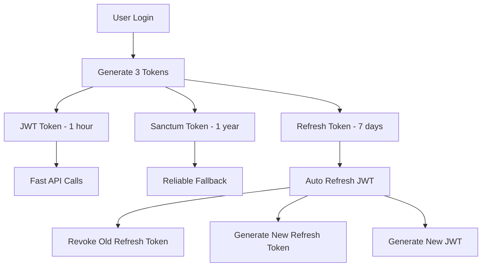

Pertanyaan yang sangat bagus! Mari saya jelaskan mengapa kita perlu membuat tabel baru `refresh_tokens` terpisah dari tabel yang sudah ada:

## 🤔 **Mengapa Perlu Tabel Refresh Token Terpisah?**

### **1. Perbedaan Konsep dan Tujuan**

#### **Personal Access Tokens (Sanctum)**
```php
// Tabel: personal_access_tokens
// Tujuan: Long-lived API access (1 tahun)
// Digunakan untuk: Sanctum authentication
```

#### **Refresh Tokens**
```php
// Tabel: refresh_tokens  
// Tujuan: Short-lived token untuk renew JWT (7 hari)
// Digunakan untuk: Auto-refresh JWT tanpa re-login
```

### **2. Perbedaan Karakteristik**

| Aspect | Personal Access Tokens | Refresh Tokens |
|--------|----------------------|----------------|
| **Lifetime** | 1 tahun | 7 hari |
| **Usage** | API authentication | JWT refresh only |
| **Rotation** | Tidak | Ya (setiap refresh) |
| **Scope** | Full API access | Limited to refresh |
| **Security Level** | High | Medium |

### **3. Security Best Practices**

#### **Token Rotation**
```php
// Refresh token HARUS di-rotate setiap kali digunakan
public function refreshWithToken(string $refreshToken): array
{
    // 1. Validate current refresh token
    $tokenRecord = $this->validateRefreshToken($refreshToken);
    
    // 2. Generate new JWT
    $newJwt = JWTAuth::fromUser($user);
    
    // 3. REVOKE old refresh token (security!)
    $this->revokeRefreshToken($refreshToken);
    
    // 4. Generate NEW refresh token
    $newRefreshToken = $this->createRefreshToken($user);
    
    return [
        'access_token' => $newJwt,
        'refresh_token' => $newRefreshToken, // New token!
    ];
}
```

### **4. Database Design yang Optimal**

#### **Refresh Tokens Table**
```php
Schema::create('refresh_tokens', function (Blueprint $table) {
    $table->id();
    $table->foreignId('user_id')->constrained()->onDelete('cascade');
    $table->string('token', 255)->unique(); // Hashed token
    $table->timestamp('expires_at');
    $table->boolean('is_revoked')->default(false);
    $table->timestamps();

    // Indexes untuk performance
    $table->index(['user_id', 'is_revoked']);
    $table->index(['token', 'is_revoked']);
    $table->index('expires_at');
});
```

#### **Personal Access Tokens Table (Sanctum)**
```php
// Laravel Sanctum sudah punya tabel sendiri
// personal_access_tokens dengan struktur yang berbeda
```

### **5. Keuntungan Tabel Terpisah**

#### **A. Security Isolation**
```php
// Refresh tokens bisa di-revoke tanpa mempengaruhi Sanctum tokens
public function revokeAllRefreshTokens(User $user): void
{
    DB::table('refresh_tokens')
        ->where('user_id', $user->id)
        ->update(['is_revoked' => true]);
    
    // Sanctum tokens tetap aktif untuk API access
}
```

#### **B. Performance Optimization**
```php
// Query yang lebih cepat dan spesifik
public function validateRefreshToken(string $token): ?object
{
    return DB::table('refresh_tokens')
        ->where('token', hash('sha256', $token))
        ->where('is_revoked', false)
        ->where('expires_at', '>', now())
        ->first();
}
```

#### **C. Audit Trail**
```php
// Tracking refresh token usage
public function logRefreshTokenUsage(string $token, User $user): void
{
    DB::table('refresh_tokens')
        ->where('token', hash('sha256', $token))
        ->update([
            'last_used_at' => now(),
            'updated_at' => now()
        ]);
}
```

### **6. Contoh Implementasi Tanpa Tabel Terpisah (TIDAK RECOMMENDED)**

#### **❌ Menggunakan Personal Access Tokens untuk Refresh**
```php
// MASALAH: Tidak bisa rotation, security risk
public function refreshWithPersonalToken(string $token): array
{
    $personalToken = PersonalAccessToken::findToken($token);
    
    // ❌ MASALAH: Token tidak bisa di-revoke dan re-create
    // ❌ MASALAH: Tidak ada rotation
    // ❌ MASALAH: Lifetime terlalu panjang untuk refresh
    
    return [
        'access_token' => JWTAuth::fromUser($personalToken->tokenable),
        'refresh_token' => $token, // Same token - SECURITY RISK!
    ];
}
```

### **7. Arsitektur yang Benar**



### **8. Real-World Example**

#### **Scenario: User menggunakan aplikasi mobile**
```php
// 1. User login - dapat 3 tokens
{
    "access_token": "jwt_token_1",      // 1 hour
    "refresh_token": "refresh_token_1", // 7 days  
    "sanctum_token": "sanctum_token_1"  // 1 year
}

// 2. JWT expired, user refresh
// Input: refresh_token_1
// Output: 
{
    "access_token": "jwt_token_2",      // New JWT
    "refresh_token": "refresh_token_2", // New refresh token
    "sanctum_token": "sanctum_token_1"  // Same Sanctum
}

// 3. refresh_token_1 di-revoke dari database
// refresh_token_2 aktif untuk next refresh
```

## 🎯 **Kesimpulan**

Tabel `refresh_tokens` terpisah diperlukan karena:

1. **🔒 Security**: Token rotation dan revocation yang proper
2. **⚡ Performance**: Query yang lebih cepat dan spesifik  
3. **🎯 Purpose**: Khusus untuk refresh JWT, bukan API access
4. **📊 Audit**: Tracking dan monitoring yang lebih baik
5. **🔄 Flexibility**: Bisa di-manage terpisah dari Sanctum tokens

**Ini adalah best practice untuk sistem authentication yang aman dan scalable! 🚀**
