# Webhook Signature Middleware - Arsitektur & Flow Kerja

## 📋 **Daftar Isi**
1. [Overview](#overview)
2. [Arsitektur Sistem](#arsitektur-sistem)
3. [Flow Kerja](#flow-kerja)
4. [Komponen Utama](#komponen-utama)
5. [Implementasi](#implementasi)
6. [Keamanan](#keamanan)
7. [Monitoring & Logging](#monitoring--logging)
8. [Troubleshooting](#troubleshooting)

---

## 🎯 **Overview**

`WebhookSignatureMiddleware` adalah middleware keamanan yang memverifikasi keaslian request webhook dari external services (Stripe, Midtrans, Xendit, dll) menggunakan HMAC-SHA256 signature verification.

### **Tujuan Utama:**
- ✅ Verifikasi keaslian webhook request
- ✅ Mencegah replay attacks
- ✅ Melindungi dari timing attacks
- ✅ Audit trail untuk security monitoring
- ✅ Early rejection untuk request invalid

---

## 🏗️ **Arsitektur Sistem**


### **Komponen Arsitektur:**

```
┌─────────────────────────────────────────────────────────────┐
│                    EXTERNAL SERVICES                        │
│  ┌─────────┐  ┌─────────┐  ┌─────────┐  ┌─────────┐        │
│  │ Stripe  │  │Midtrans │  │ Xendit  │  │ Others  │        │
│  └─────────┘  └─────────┘  └─────────┘  └─────────┘        │
└─────────────────────┬───────────────────────────────────────┘
                      │ Webhook Request + Signature
                      ▼
┌─────────────────────────────────────────────────────────────┐
│                 LARAVEL APPLICATION                         │
│  ┌─────────────────────────────────────────────────────────┐│
│  │              ROUTE LAYER                                ││
│  │  POST /webhooks/subscriptions                           ││
│  │  POST /webhooks/payments/stripe                         ││
│  │  POST /webhooks/payments/midtrans                       ││
│  └─────────────────────────────────────────────────────────┘│
│                              │                              │
│                              ▼                              │
│  ┌─────────────────────────────────────────────────────────┐│
│  │         WebhookSignatureMiddleware                      ││
│  │  • Extract Signature                                    ││
│  │  • Generate Expected Signature                          ││
│  │  • Verify Signature                                     ││
│  │  • Add Context to Request                               ││
│  └─────────────────────────────────────────────────────────┘│
│                              │                              │
│                              ▼                              │
│  ┌─────────────────────────────────────────────────────────┐│
│  │              CONTROLLER LAYER                           ││
│  │  • Process Webhook                                      ││
│  │  • Update Database                                      ││
│  │  • Send Notifications                                   ││
│  └─────────────────────────────────────────────────────────┘│
└─────────────────────────────────────────────────────────────┘
```

---

## 🔄 **Flow Kerja**

### **1. Request Flow**


### **2. Detailed Step-by-Step Flow**

#### **Step 1: Request Reception**
```php
// 1. External service sends webhook
POST /api/webhooks/subscriptions
Headers:
  - X-Webhook-Signature: sha256=abc123...
  - Content-Type: application/json
Body: {"event": "subscription.created", "data": {...}}
```

#### **Step 2: Middleware Processing**
```php
public function handle(Request $request, Closure $next): Response
{
    // 2.1 Extract signature from headers
    $signature = $request->header('X-Webhook-Signature') ?? 
                $request->header('X-Hub-Signature-256') ?? 
                $request->header('Stripe-Signature');

    // 2.2 Get webhook secret from config
    $webhookSecret = config('webhooks.secret');

    // 2.3 Generate expected signature
    $payload = $request->getContent();
    $expectedSignature = $this->generateSignature($payload, $webhookSecret);

    // 2.4 Verify signature
    if (!$this->verifySignature($signature, $expectedSignature)) {
        return $this->unauthorizedResponse('Invalid webhook signature');
    }

    // 2.5 Add context to request
    $request->merge(['webhook_context' => [...]]);

    return $next($request);
}
```

#### **Step 3: Controller Processing**
```php
public function webhook(Request $request)
{
    // 3.1 Verify webhook context
    $webhookContext = $request->get('webhook_context');
    
    // 3.2 Process webhook data
    $payload = $request->all();
    
    // 3.3 Business logic
    $this->processWebhookEvent($payload);
    
    return response()->json(['status' => 'success']);
}
```

---

## 🔧 **Komponen Utama**

### **1. Signature Generation**
```php
protected function generateSignature(string $payload, string $secret): string
{
    return 'sha256=' . hash_hmac('sha256', $payload, $secret);
}
```

### **2. Signature Verification**
```php
protected function verifySignature(string $received, string $expected): bool
{
    // Timing attack protection
    return hash_equals($expected, $received);
}
```

### **3. Header Extraction**
```php
$signature = $request->header('X-Webhook-Signature') ?? 
            $request->header('X-Hub-Signature-256') ?? 
            $request->header('Stripe-Signature');
```

### **4. Context Addition**
```php
$request->merge([
    'webhook_context' => [
        'signature' => $signature,
        'verified' => true,
        'timestamp' => now()->toISOString(),
    ]
]);
```

---

## 🛡️ **Keamanan**

### **1. Signature Verification Process**

```mermaid
graph LR
    A[Raw Payload] --> B[HMAC-SHA256]
    C[Secret Key] --> B
    B --> D[Expected Signature]
    E[Received Signature] --> F[hash_equals]
    D --> F
    F --> G{Match?}
    G -->|Yes| H[✅ Valid]
    G -->|No| I[❌ Invalid]
```



### **2. Security Features**

#### **A. Timing Attack Protection**
```php
// Menggunakan hash_equals() untuk mencegah timing attacks
return hash_equals($expected, $received);
```

#### **B. Signature Format Validation**
```php
// Validasi format signature
if (!str_starts_with($signature, 'sha256=')) {
    return $this->unauthorizedResponse('Invalid signature format');
}
```

#### **C. Secret Key Protection**
```php
// Secret key harus dikonfigurasi
if (!$webhookSecret) {
    Log::error('Webhook secret not configured');
    return $this->serverErrorResponse('Webhook configuration error');
}
```

### **3. Attack Prevention**

| Attack Type | Prevention Method | Implementation |
|-------------|------------------|----------------|
| **Replay Attack** | Timestamp validation | `t=1492774577` in signature |
| **Timing Attack** | Constant-time comparison | `hash_equals()` |
| **Signature Forgery** | HMAC-SHA256 | `hash_hmac('sha256', $payload, $secret)` |
| **Request Spoofing** | Header validation | Multiple header sources |

---

## 📊 **Monitoring & Logging**

### **1. Security Event Logging**

```php
// Log invalid signature attempts
Log::warning('Invalid webhook signature', [
    'received' => $signature,
    'expected' => $expectedSignature,
    'url' => $request->url(),
    'ip' => $request->ip(),
    'user_agent' => $request->userAgent(),
    'timestamp' => now()->toISOString()
]);
```

### **2. Monitoring Dashboard**

```mermaid
graph TB
    A[Webhook Requests] --> B[Signature Validation]
    B --> C{Valid?}
    C -->|Yes| D[✅ Success Log]
    C -->|No| E[❌ Security Alert]
    D --> F[Business Logic Processing]
    E --> G[Security Monitoring]
    F --> H[Database Update]
    G --> I[Alert System]
    H --> J[Response Log]
    I --> K[Admin Notification]
```



### **3. Log Structure**

```json
{
  "level": "warning",
  "message": "Invalid webhook signature",
  "context": {
    "received": "sha256=abc123...",
    "expected": "sha256=def456...",
    "url": "https://app.com/api/webhooks/subscriptions",
    "ip": "192.168.1.100",
    "user_agent": "Stripe/1.0",
    "timestamp": "2024-01-15T10:30:00Z"
  }
}
```

---

## 🔧 **Implementasi**

### **1. Route Configuration**

```php
// routes/api.php
Route::prefix('webhooks')->group(function () {
    Route::post('/subscriptions', [SubscriptionController::class, 'webhook'])
        ->middleware(['throttle:webhook', 'webhook.signature']);
    
    Route::post('/payments/stripe', [PaymentController::class, 'stripeWebhook'])
        ->middleware(['throttle:webhook', 'webhook.signature']);
});
```

### **2. Middleware Registration**

```php
// bootstrap/app.php
$middleware->alias([
    'webhook.signature' => \App\Http\Middleware\WebhookSignatureMiddleware::class,
    'throttle.webhook' => \Illuminate\Routing\Middleware\ThrottleRequests::class.':100,1',
]);
```

### **3. Configuration**

```php
// config/webhooks.php
return [
    'secret' => env('WEBHOOK_SECRET'),
    'stripe_secret' => env('STRIPE_WEBHOOK_SECRET'),
    'midtrans_secret' => env('MIDTRANS_WEBHOOK_SECRET'),
    'xendit_secret' => env('XENDIT_WEBHOOK_SECRET'),
];
```

### **4. Environment Variables**

```env
# .env
WEBHOOK_SECRET=your_webhook_secret_here
STRIPE_WEBHOOK_SECRET=whsec_your_stripe_secret
MIDTRANS_WEBHOOK_SECRET=your_midtrans_secret
XENDIT_WEBHOOK_SECRET=your_xendit_secret
```

---

## 🚨 **Troubleshooting**

### **1. Common Issues**

#### **A. Signature Mismatch**
```bash
# Error: Invalid webhook signature
# Solution: Check secret key configuration
```

#### **B. Missing Headers**
```bash
# Error: Webhook signature required
# Solution: Ensure external service sends proper headers
```

#### **C. Configuration Error**
```bash
# Error: Webhook configuration error
# Solution: Set WEBHOOK_SECRET in .env file
```

### **2. Debug Mode**

```php
// Enable debug logging
Log::debug('Webhook signature verification', [
    'payload_length' => strlen($payload),
    'secret_configured' => !empty($webhookSecret),
    'signature_present' => !empty($signature),
    'headers' => $request->headers->all()
]);
```

### **3. Testing**

```php
// Test webhook signature
public function testWebhookSignature()
{
    $payload = '{"test": "data"}';
    $secret = 'test_secret';
    $signature = 'sha256=' . hash_hmac('sha256', $payload, $secret);
    
    $request = Request::create('/webhooks/test', 'POST', [], [], [], [
        'HTTP_X_WEBHOOK_SIGNATURE' => $signature
    ], $payload);
    
    $middleware = new WebhookSignatureMiddleware();
    $response = $middleware->handle($request, function($req) {
        return response()->json(['success' => true]);
    });
    
    $this->assertEquals(200, $response->getStatusCode());
}
```

---

## 📈 **Performance Considerations**

### **1. Optimization**

- ✅ **Early Rejection**: Invalid requests rejected before controller
- ✅ **Efficient Hashing**: HMAC-SHA256 is fast and secure
- ✅ **Minimal Memory**: No unnecessary data storage
- ✅ **Throttling**: Rate limiting to prevent abuse

### **2. Metrics**

```php
// Performance metrics
$startTime = microtime(true);
// ... signature verification
$endTime = microtime(true);
$processingTime = ($endTime - $startTime) * 1000; // milliseconds

Log::info('Webhook signature verification completed', [
    'processing_time_ms' => $processingTime,
    'payload_size_bytes' => strlen($payload)
]);
```

---

## 🎯 **Best Practices**

1. **🔐 Secret Management**: Use environment variables for secrets
2. **📊 Monitoring**: Log all security events
3. **⚡ Performance**: Use efficient hashing algorithms
4. **🛡️ Security**: Implement timing attack protection
5. **🧪 Testing**: Test with various signature formats
6. **📝 Documentation**: Document webhook endpoints
7. **🔄 Updates**: Keep middleware updated with security patches

---

## 📚 **References**

- [Laravel Middleware Documentation](https://laravel.com/docs/middleware)
- [HMAC-SHA256 Specification](https://tools.ietf.org/html/rfc2104)
- [Webhook Security Best Practices](https://webhook.site/security)
- [Stripe Webhook Security](https://stripe.com/docs/webhooks/signatures)
- [Timing Attack Prevention](https://cryptocoding.net/index.php/Coding_rules#Compare_secret_strings_in_constant_time)
