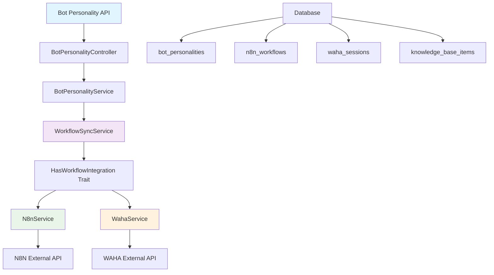

# Bot Personalities Integration Documentation

## 📋 Table of Contents

1. [Overview](#overview)
2. [Architecture](#architecture)
3. [API Endpoints](#api-endpoints)
4. [Workflow Integration](#workflow-integration)
5. [Service Layer](#service-layer)
6. [Database Schema](#database-schema)
7. [Configuration](#configuration)
8. [Testing](#testing)
9. [Troubleshooting](#troubleshooting)
10. [Best Practices](#best-practices)

---

## 🎯 Overview

Bot Personalities Integration adalah sistem yang memungkinkan pembuatan, pengelolaan, dan sinkronisasi bot personalities dengan workflow eksternal seperti N8N dan WAHA (WhatsApp HTTP API). Sistem ini dirancang untuk memastikan konsistensi data antara database internal dan layanan pihak ketiga.

### Key Features

- ✅ **CRUD Operations**: Create, Read, Update, Delete bot personalities
- ✅ **Workflow Integration**: Otomatis sinkronisasi dengan N8N workflows
- ✅ **WAHA Integration**: Integrasi dengan WhatsApp HTTP API
- ✅ **Knowledge Base**: Integrasi dengan knowledge base items
- ✅ **Real-time Sync**: Sinkronisasi real-time antara sistem
- ✅ **Health Monitoring**: Monitoring status dan kesehatan sistem

---

## 🏗️ Architecture

### System Components



### Data Flow

1. **Creation Flow**: User → API → Service → Database → External Services
2. **Sync Flow**: Database Changes → WorkflowSyncService → External APIs
3. **Status Flow**: External APIs → Services → Database → API Response

---

## 🔌 API Endpoints

### Base URL
```
http://localhost:9000/api/v1/bot-personalities
```

### Authentication
```bash
Authorization: Bearer {jwt_token}
```

### Endpoints

#### 1. Create Bot Personality
```http
POST /api/v1/bot-personalities
Content-Type: application/json

{
  "name": "Customer Support Bot",
  "code": "customer_support_bot",
  "display_name": "Customer Support Bot",
  "description": "AI bot for customer support",
  "language": "english",
  "formality_level": "formal",
  "personality_traits": ["helpful", "professional"],
  "n8n_workflow_id": "b5feb444-f51a-4665-a54e-c0b3168b8289",
  "waha_session_id": "4d4724c2-693c-4880-9253-cb3aecceb528",
  "knowledge_base_item_id": "a8941fe4-459a-4647-aef7-3b6b050cbd0d"
}
```

#### 2. Get All Bot Personalities
```http
GET /api/v1/bot-personalities
```

#### 3. Get Specific Bot Personality
```http
GET /api/v1/bot-personalities/{id}
```

#### 4. Update Bot Personality
```http
PUT /api/v1/bot-personalities/{id}
Content-Type: application/json

{
  "name": "Updated Bot Name",
  "status": "active"
}
```

#### 5. Delete Bot Personality
```http
DELETE /api/v1/bot-personalities/{id}
```

#### 6. Sync Workflow
```http
POST /api/v1/bot-personalities/{id}/sync
```

#### 7. Get Sync Status
```http
GET /api/v1/bot-personalities/{id}/sync-status
```

#### 8. Bulk Sync
```http
POST /api/v1/bot-personalities/bulk-sync
Content-Type: application/json

{
  "bot_personality_ids": [
    "uuid1",
    "uuid2",
    "uuid3"
  ]
}
```

#### 9. Organization Sync
```http
POST /api/v1/bot-personalities/sync-organization
```

---

## ⚙️ Workflow Integration

### 3-Phase Workflow Process

#### Phase 1: Data Initialization (Transactional)
```php
// 1. Validate dependencies
$wahaSession = $this->getValidatedWahaSession($wahaSessionId);
$knowledgeBaseItem = $this->getValidatedKnowledgeBaseItem($knowledgeBaseItemId);

// 2. Create bot personality
$botPersonality = BotPersonality::create([
    'name' => $data['name'],
    'waha_session_id' => $wahaSessionId,
    'knowledge_base_item_id' => $knowledgeBaseItemId,
    'n8n_workflow_id' => $wahaSession->n8n_workflow_id,
    'status' => 'creating'
]);
```

#### Phase 2: Activation (Concurrent)
```php
// Process A: Activate N8N Workflow
$n8nResult = $this->activateN8nWorkflow($n8nWorkflowId);

// Process B: Update Internal Status
$botPersonality->update(['status' => 'active']);
```

#### Phase 3: Configuration Sync
```php
// Sync system message from knowledge base
$systemMessage = $this->getSystemMessageFromKnowledgeBase($knowledgeBaseItem);

// Update N8N configuration
$this->updateN8nSystemMessage($n8nWorkflowId, $systemMessage);

// Update database configuration
$this->updateDatabaseWorkflowConfiguration($n8nWorkflowId, [
    'system_message' => $systemMessage
]);
```

---

## 🔧 Service Layer

### BotPersonalityService
```php
class BotPersonalityService extends BaseService
{
    protected WorkflowSyncService $workflowSyncService;

    public function createForOrganization(array $data, string $organizationId): BotPersonality
    {
        $personality = $this->create($data);
        
        // Auto-sync workflow after creation
        $this->workflowSyncService->syncBotPersonalityWorkflow($personality);
        
        return $personality;
    }
}
```

### WorkflowSyncService
```php
class WorkflowSyncService
{
    use HasWorkflowIntegration;

    protected ?\App\Services\Waha\WahaService $wahaService = null;

    public function syncBotPersonalityWorkflow(BotPersonality $botPersonality): array
    {
        // Sync system message
        $results['system_message_sync'] = $this->syncSystemMessageFromKnowledgeBase($botPersonality);
        
        // Sync workflow configuration
        $results['workflow_config_sync'] = $this->syncWorkflowConfiguration($botPersonality);
        
        // Activate workflow if needed
        $results['workflow_activation'] = $this->activateWorkflowIfNeeded($botPersonality->n8n_workflow_id);
        
        return $results;
    }
}
```

### HasWorkflowIntegration Trait
```php
trait HasWorkflowIntegration
{
    protected ?\App\Services\N8n\N8nService $n8nService = null;

    protected function getN8nService(): \App\Services\N8n\N8nService
    {
        if ($this->n8nService === null) {
            $this->n8nService = new \App\Services\N8n\N8nService([
                'base_url' => config('n8n.server.base_url'),
                'api_key' => config('n8n.server.api_key'),
                'timeout' => config('n8n.server.timeout', 30),
            ]);
        }
        return $this->n8nService;
    }

    protected function activateN8nWorkflow(string $n8nWorkflowId): array
    {
        $n8nService = $this->getN8nService();
        $result = $n8nService->activateWorkflow($actualWorkflowId);
        
        // Update database status
        if ($result['active'] === true) {
            $n8nWorkflow->update([
                'is_enabled' => true,
                'status' => 'active'
            ]);
        }
        
        return $result;
    }
}
```

---

## 🗄️ Database Schema

### bot_personalities Table
```sql
CREATE TABLE bot_personalities (
    id UUID PRIMARY KEY,
    organization_id UUID NOT NULL,
    name VARCHAR(255) NOT NULL,
    code VARCHAR(50) NOT NULL,
    display_name VARCHAR(255),
    description TEXT,
    language VARCHAR(50) DEFAULT 'english',
    formality_level VARCHAR(20) DEFAULT 'formal',
    personality_traits JSON,
    response_delay_ms INTEGER DEFAULT 1000,
    typing_indicator BOOLEAN DEFAULT true,
    max_response_length INTEGER DEFAULT 500,
    enable_small_talk BOOLEAN DEFAULT false,
    confidence_threshold DECIMAL(3,2) DEFAULT 0.80,
    learning_enabled BOOLEAN DEFAULT true,
    status VARCHAR(20) DEFAULT 'active',
    
    -- Workflow Integration Fields
    n8n_workflow_id UUID,
    waha_session_id UUID,
    knowledge_base_item_id UUID,
    
    created_at TIMESTAMP,
    updated_at TIMESTAMP,
    
    FOREIGN KEY (organization_id) REFERENCES organizations(id),
    FOREIGN KEY (n8n_workflow_id) REFERENCES n8n_workflows(id),
    FOREIGN KEY (waha_session_id) REFERENCES waha_sessions(id),
    FOREIGN KEY (knowledge_base_item_id) REFERENCES knowledge_base_items(id)
);
```

### n8n_workflows Table
```sql
CREATE TABLE n8n_workflows (
    id UUID PRIMARY KEY,
    workflow_id VARCHAR(255) UNIQUE NOT NULL,
    name VARCHAR(255) NOT NULL,
    is_enabled BOOLEAN DEFAULT false,
    status VARCHAR(20) DEFAULT 'inactive',
    workflow_data JSON,
    nodes JSON,
    settings JSON,
    created_at TIMESTAMP,
    updated_at TIMESTAMP
);
```

### waha_sessions Table
```sql
CREATE TABLE waha_sessions (
    id UUID PRIMARY KEY,
    organization_id UUID NOT NULL,
    session_name VARCHAR(255) NOT NULL,
    n8n_workflow_id UUID,
    status VARCHAR(20) DEFAULT 'inactive',
    is_connected BOOLEAN DEFAULT false,
    created_at TIMESTAMP,
    updated_at TIMESTAMP,
    
    FOREIGN KEY (organization_id) REFERENCES organizations(id),
    FOREIGN KEY (n8n_workflow_id) REFERENCES n8n_workflows(id)
);
```

---

## ⚙️ Configuration

### Environment Variables
```env
# N8N Configuration
N8N_BASE_URL=http://100.81.120.54:5678
N8N_API_KEY=your_n8n_api_key
N8N_TIMEOUT=30

# WAHA Configuration
WAHA_BASE_URL=http://localhost:3000
WAHA_API_KEY=your_waha_api_key
WAHA_TIMEOUT=30
```

### Config Files

#### config/n8n.php
```php
return [
    'server' => [
        'base_url' => env('N8N_BASE_URL', 'http://localhost:5678'),
        'api_key' => env('N8N_API_KEY', ''),
        'timeout' => env('N8N_TIMEOUT', 30),
    ],
];
```

#### config/services.php
```php
return [
    'n8n' => [
        'base_url' => env('N8N_BASE_URL', 'http://100.81.120.54:5678'),
        'api_key' => env('N8N_API_KEY'),
    ],
];
```

---

## 🧪 Testing

### Manual Testing Commands

#### 1. Login
```bash
curl -X POST http://localhost/api/auth/login \
  -H "Content-Type: application/json" \
  -d '{"email": "admin@test.com", "password": "Password123!"}'
```

#### 2. Create Bot Personality
```bash
curl -X POST http://localhost/api/v1/bot-personalities \
  -H "Authorization: Bearer {token}" \
  -H "Content-Type: application/json" \
  -d '{
    "name": "Test Bot",
    "code": "test_bot",
    "n8n_workflow_id": "b5feb444-f51a-4665-a54e-c0b3168b8289",
    "waha_session_id": "4d4724c2-693c-4880-9253-cb3aecceb528",
    "knowledge_base_item_id": "a8941fe4-459a-4647-aef7-3b6b050cbd0d"
  }'
```

#### 3. Sync Workflow
```bash
curl -X POST http://localhost/api/v1/bot-personalities/{id}/sync \
  -H "Authorization: Bearer {token}"
```

#### 4. Get Sync Status
```bash
curl -X GET http://localhost/api/v1/bot-personalities/{id}/sync-status \
  -H "Authorization: Bearer {token}"
```

### Expected Responses

#### Successful Creation
```json
{
  "success": true,
  "message": "Bot personality created successfully",
  "data": {
    "id": "uuid",
    "name": "Test Bot",
    "n8n_workflow_id": "b5feb444-f51a-4665-a54e-c0b3168b8289",
    "waha_session_id": "4d4724c2-693c-4880-9253-cb3aecceb528",
    "knowledge_base_item_id": "a8941fe4-459a-4647-aef7-3b6b050cbd0d",
    "status": "active"
  }
}
```

#### Sync Status
```json
{
  "success": true,
  "message": "Sync status retrieved successfully",
  "data": {
    "bot_personality_id": "uuid",
    "has_waha_session": true,
    "has_knowledge_base_item": true,
    "has_n8n_workflow": true,
    "workflow_status": true,
    "waha_session_connected": false,
    "sync_health": "waha_session_disconnected"
  }
}
```

---

## 🔍 Troubleshooting

### Common Issues

#### 1. N8N Connection Error
```
Error: cURL error 7: Failed to connect to localhost:5678
```
**Solution**: Check N8N server status and update `N8N_BASE_URL` in config.

#### 2. WAHA Session Not Found
```
Error: WAHA session with ID {id} not found in database
```
**Solution**: Verify `waha_session_id` exists in `waha_sessions` table.

#### 3. Knowledge Base Item Not Found
```
Error: KnowledgeBaseItem {id} not found
```
**Solution**: Verify `knowledge_base_item_id` exists in `knowledge_base_items` table.

#### 4. Workflow Not Active
```
Error: Workflow is not active in N8N
```
**Solution**: Check N8N workflow status and ensure it's properly activated.

### Debug Commands

#### Check Database Status
```bash
docker exec cte_app php artisan tinker --execute="
\$bot = \App\Models\BotPersonality::find('uuid');
echo 'Bot: ' . \$bot->name . PHP_EOL;
echo 'N8N Workflow: ' . \$bot->n8n_workflow_id . PHP_EOL;
echo 'WAHA Session: ' . \$bot->waha_session_id . PHP_EOL;
echo 'Knowledge Base: ' . \$bot->knowledge_base_item_id . PHP_EOL;
"
```

#### Check N8N Workflow Status
```bash
docker exec cte_app php artisan tinker --execute="
\$workflow = \App\Models\N8nWorkflow::find('uuid');
echo 'Workflow ID: ' . \$workflow->workflow_id . PHP_EOL;
echo 'Is Enabled: ' . (\$workflow->is_enabled ? 'Yes' : 'No') . PHP_EOL;
echo 'Status: ' . \$workflow->status . PHP_EOL;
"
```

---

## 📚 Best Practices

### 1. Error Handling
- Always wrap external API calls in try-catch blocks
- Implement retry mechanisms for transient failures
- Log all errors with sufficient context

### 2. Performance
- Use singleton pattern for service instances
- Implement caching for frequently accessed data
- Use database transactions for data consistency

### 3. Security
- Validate all input data
- Use proper authentication and authorization
- Sanitize data before external API calls

### 4. Monitoring
- Implement health checks for external services
- Monitor sync status and workflow health
- Set up alerts for failed synchronizations

### 5. Code Organization
- Follow DRY principles
- Use traits for reusable functionality
- Separate concerns between services

---

## 📞 Support

For technical support or questions regarding Bot Personalities Integration:

- **Documentation**: This file
- **API Testing**: Use provided curl commands
- **Database Issues**: Check troubleshooting section
- **External Services**: Verify N8N and WAHA configurations

---

*Last Updated: September 24, 2025*
*Version: 1.0.0*
