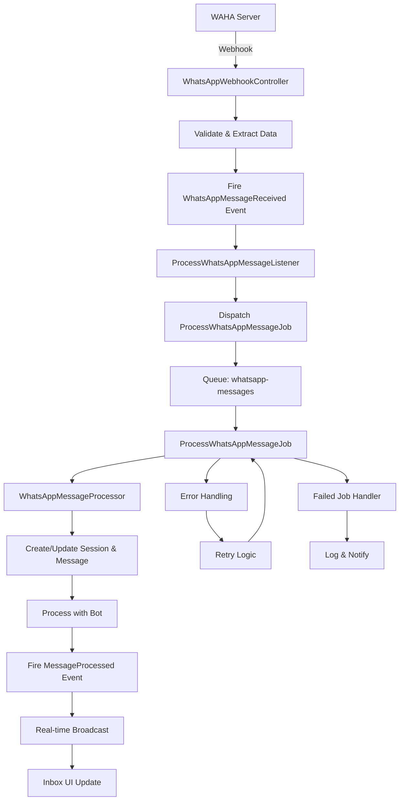

# Event-Driven WhatsApp Integration

## Overview

This document describes the implementation of event-driven architecture for WhatsApp message processing using Laravel Events and Queues.

## Architecture

```
WAHA Server → Webhook → WhatsAppWebhookController → WhatsAppMessageReceived Event → ProcessWhatsAppMessageListener → ProcessWhatsAppMessageJob → MessageProcessed Event → Real-time Updates
```

## Components

### 1. Events

#### WhatsAppMessageReceived
- **Purpose**: Fired when a WhatsApp message is received via webhook
- **Data**: Message data and organization ID
- **Broadcasting**: Organization-specific private channel

#### MessageProcessed
- **Purpose**: Fired when a message has been successfully processed
- **Data**: Session, message, and processing result
- **Broadcasting**: Organization and inbox channels for real-time updates

### 2. Jobs

#### ProcessWhatsAppMessageJob
- **Queue**: `whatsapp-messages`
- **Features**:
  - Duplicate message detection
  - Database transactions
  - Retry mechanism (3 attempts)
  - Processing time tracking
  - Comprehensive logging
  - Failure handling

### 3. Listeners

#### ProcessWhatsAppMessageListener
- **Purpose**: Handles WhatsAppMessageReceived events
- **Action**: Dispatches ProcessWhatsAppMessageJob
- **Queue**: Queued listener for better performance

## Benefits

### 1. **Asynchronous Processing**
- Webhook responds immediately to WAHA
- Message processing happens in background
- Better user experience and system reliability

### 2. **Scalability**
- Queue system handles high message volumes
- Redis-based queue for performance
- Load balancing across multiple workers

### 3. **Reliability**
- Retry mechanism for failed jobs
- Duplicate message detection
- Comprehensive error handling and logging

### 4. **Real-time Updates**
- WebSocket broadcasting for live inbox updates
- Organization-specific channels
- Event-driven UI updates

### 5. **Monitoring**
- Detailed logging at each step
- Processing time tracking
- Failure analytics

## Configuration

### Queue Configuration
```php
'whatsapp-messages' => [
    'driver' => 'redis',
    'connection' => env('REDIS_WHATSAPP_QUEUE_CONNECTION', 'default'),
    'queue' => env('REDIS_WHATSAPP_QUEUE', 'whatsapp-messages'),
    'retry_after' => 120,
    'block_for' => null,
    'after_commit' => false,
],
```

### Environment Variables
```env
REDIS_WHATSAPP_QUEUE_CONNECTION=default
REDIS_WHATSAPP_QUEUE=whatsapp-messages
REDIS_WHATSAPP_QUEUE_RETRY_AFTER=120
```

## Usage

### Starting Queue Workers
```bash
# Process WhatsApp messages queue
php artisan queue:work --queue=whatsapp-messages --tries=3 --timeout=120

# Process all queues
php artisan queue:work --tries=3 --timeout=120
```

### Monitoring
```bash
# Check queue status
php artisan queue:monitor whatsapp-messages

# View failed jobs
php artisan queue:failed

# Retry failed jobs
php artisan queue:retry all
```

## Flow Diagram



## Error Handling

### 1. **Duplicate Detection**
- Checks for existing messages by WhatsApp message ID
- Prevents duplicate processing
- Logs warnings for duplicates

### 2. **Retry Mechanism**
- 3 attempts for failed jobs
- Exponential backoff
- Comprehensive error logging

### 3. **Failure Handling**
- Failed job logging
- Administrator notifications
- Manual review queue

## Performance Considerations

### 1. **Queue Optimization**
- Dedicated queue for WhatsApp messages
- Redis for high-performance queuing
- Configurable retry and timeout settings

### 2. **Database Transactions**
- Atomic operations for data consistency
- Rollback on failures
- Optimized queries

### 3. **Memory Management**
- Efficient data serialization
- Proper cleanup of resources
- Monitoring of memory usage

## Testing

### 1. **Unit Tests**
```bash
php artisan test --filter=ProcessWhatsAppMessageJob
php artisan test --filter=ProcessWhatsAppMessageListener
```

### 2. **Integration Tests**
```bash
php artisan test --filter=WhatsAppWebhookController
```

### 3. **Queue Testing**
```bash
# Test job dispatch
php artisan tinker
>>> ProcessWhatsAppMessageJob::dispatch($messageData, $organizationId);
```

## Monitoring & Analytics

### 1. **Logs**
- Message processing logs
- Error logs with stack traces
- Performance metrics

### 2. **Metrics**
- Processing time tracking
- Success/failure rates
- Queue depth monitoring

### 3. **Alerts**
- Failed job notifications
- Performance degradation alerts
- Queue backlog warnings

## Future Enhancements

### 1. **Message Prioritization**
- Priority queues for urgent messages
- VIP customer handling
- Business hours optimization

### 2. **Advanced Analytics**
- Message sentiment analysis
- Response time optimization
- Customer satisfaction tracking

### 3. **Multi-channel Support**
- Telegram integration
- Facebook Messenger
- SMS integration

## Troubleshooting

### Common Issues

1. **Queue Not Processing**
   - Check queue worker status
   - Verify Redis connection
   - Check queue configuration

2. **Duplicate Messages**
   - Verify message ID extraction
   - Check duplicate detection logic
   - Review WAHA webhook configuration

3. **Performance Issues**
   - Monitor queue depth
   - Check Redis performance
   - Optimize database queries

### Debug Commands
```bash
# Check queue status
php artisan queue:work --once --verbose

# View queue contents
php artisan queue:monitor whatsapp-messages

# Clear failed jobs
php artisan queue:flush
```
