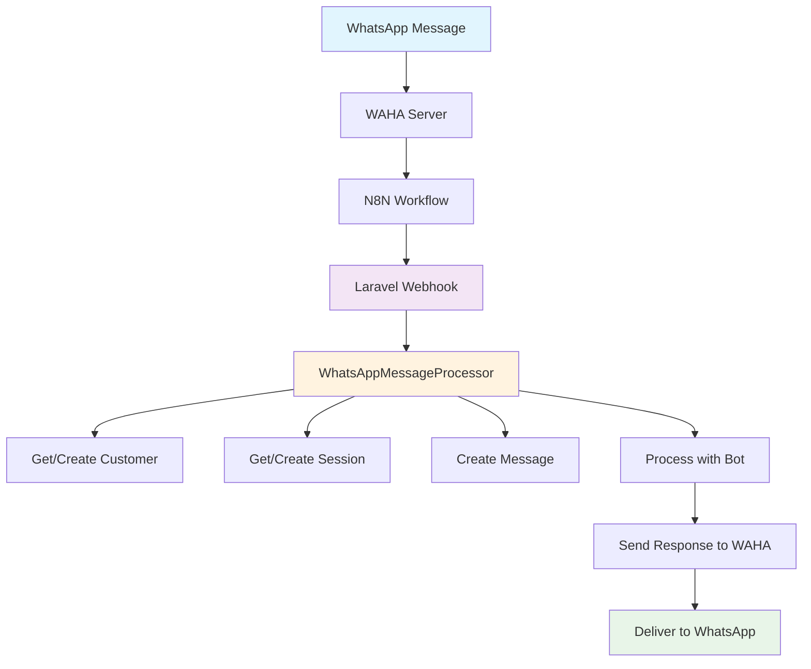

# WhatsApp Integration Deployment Guide

## 🚀 **Step-by-Step Implementation**

### **1. Backend Setup**

#### **A. Install Dependencies**
```bash
# No additional dependencies needed - uses existing Laravel features
```

#### **B. Run Migrations (if needed)**
```bash
docker exec cte_app php artisan migrate
```

#### **C. Seed Test Data**
```bash
docker exec cte_app php artisan db:seed --class=SimpleBotPersonalitySeeder
docker exec cte_app php artisan db:seed --class=SimpleChatSessionSeeder
```

### **2. Environment Configuration**

Add to your `.env` file:
```env
# WhatsApp Integration
WHATSAPP_WEBHOOK_SECRET=your_secure_secret_here
WHATSAPP_VERIFY_TOKEN=your_verify_token_here

# WAHA Configuration
WAHA_BASE_URL=http://localhost:3000
WAHA_API_KEY=your_waha_api_key

# N8N Configuration
N8N_BASE_URL=http://localhost:5678
LARAVEL_APP_URL=http://localhost:9000
```

### **3. WAHA Setup**

#### **A. Install WAHA**
```bash
# Using Docker
docker run -d \
  --name waha \
  -p 3000:3000 \
  -e WAHA_WEBHOOK_URL=http://your-n8n-url/webhook/whatsapp-message-webhook \
  devlikeapro/waha-plus
```

#### **B. Configure WAHA Session**
```bash
# Create session
curl -X POST http://localhost:3000/api/sessions/start \
  -H "Content-Type: application/json" \
  -d '{
    "name": "production-session",
    "config": {
      "webhook": {
        "url": "http://your-n8n-url/webhook/whatsapp-message-webhook"
      }
    }
  }'
```

### **4. N8N Workflow Setup**

#### **A. Import Workflow**
1. Open N8N at `http://localhost:5678`
2. Import the workflow from `docs/whatsapp-n8n-workflow.json`
3. Update webhook URL to point to your Laravel app

#### **B. Configure Environment Variables**
In N8N settings, add:
- `LARAVEL_APP_URL`: Your Laravel app URL
- `WHATSAPP_WEBHOOK_SECRET`: Your webhook secret

### **5. Testing**

#### **A. Run Tests**
```bash
docker exec cte_app php artisan test --filter=WhatsAppWebhookTest
```

#### **B. Manual Testing**
```bash
# Test webhook endpoint
curl -X POST http://localhost:9000/api/webhook/whatsapp \
  -H "Content-Type: application/json" \
  -H "X-Hub-Signature-256: sha256=your_signature" \
  -d '{
    "message": {
      "id": "test_msg_123",
      "from": "+6281234567890",
      "to": "+6281234567891",
      "text": {
        "body": "Test message from WhatsApp"
      },
      "type": "text",
      "timestamp": 1642248000
    },
    "session": "test_session_123"
  }'
```

### **6. Production Deployment**

#### **A. Security Considerations**
1. **Webhook Signature Validation**: Always validate webhook signatures
2. **Rate Limiting**: Implement rate limiting for webhook endpoints
3. **HTTPS**: Use HTTPS for all webhook URLs
4. **Environment Variables**: Store secrets securely

#### **B. Monitoring**
1. **Logs**: Monitor webhook processing logs
2. **Errors**: Set up error alerting
3. **Performance**: Monitor response times
4. **Database**: Monitor session creation rates

#### **C. Scaling**
1. **Queue Jobs**: Move heavy processing to queues
2. **Database Indexing**: Ensure proper indexes on session queries
3. **Caching**: Cache bot personalities and configurations
4. **Load Balancing**: Use load balancers for high traffic

### **7. Flow Diagram**



### **8. Troubleshooting**

#### **Common Issues:**

1. **Webhook Not Receiving Messages**
   - Check WAHA webhook configuration
   - Verify N8N workflow is active
   - Check Laravel logs for errors

2. **Session Not Created**
   - Verify organization exists
   - Check customer creation logic
   - Ensure bot personality is configured

3. **Bot Not Responding**
   - Check bot personality configuration
   - Verify AI model is working
   - Check response sending logic

4. **Database Errors**
   - Check foreign key constraints
   - Verify required fields are populated
   - Check unique constraints

#### **Debug Commands:**
```bash
# Check webhook logs
docker exec cte_app tail -f storage/logs/laravel.log

# Check database
docker exec cte_app php artisan tinker
>>> App\Models\ChatSession::count()
>>> App\Models\Customer::count()
>>> App\Models\Message::count()

# Test webhook manually
curl -X POST http://localhost:9000/api/webhook/whatsapp -d '{"test": "data"}'
```

### **9. Maintenance**

#### **Regular Tasks:**
1. **Clean Old Sessions**: Archive resolved sessions
2. **Update Bot Personalities**: Keep AI responses current
3. **Monitor Performance**: Check response times
4. **Backup Data**: Regular database backups

#### **Monitoring Endpoints:**
- Health Check: `GET /api/health`
- Webhook Status: `GET /api/webhook/status`
- Session Stats: `GET /api/v1/inbox/sessions/stats`
